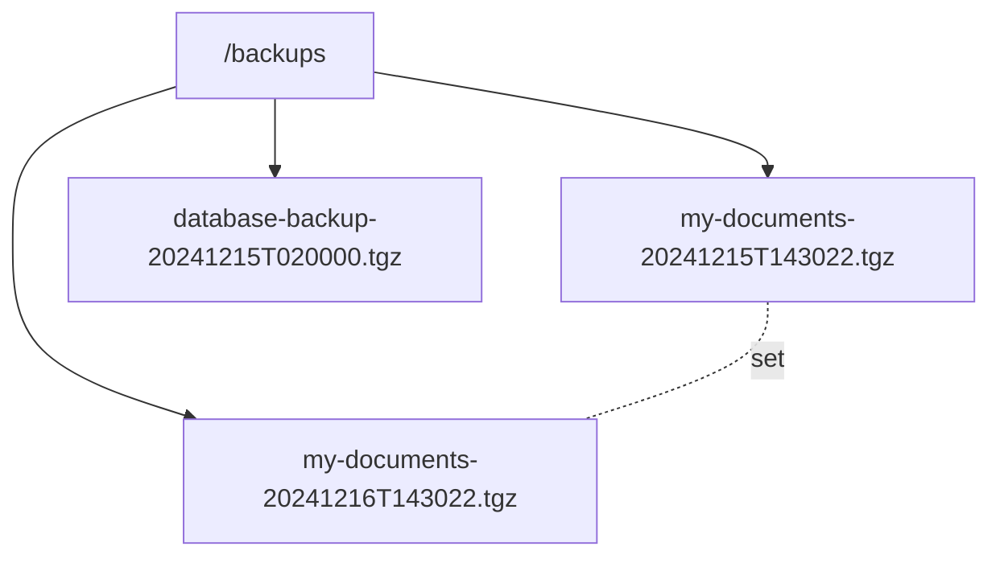

# Backup names

Every backup set has a name. The name identifies the set in logs and groups its
files, and ezbak adds a timestamp so each backup is unique.

## The filename format

A backup file is named `{name}-{timestamp}.tgz`:

```
my-documents-20241215T143022.tgz
database-backup-20241215T020000.tgz
```

The timestamp uses the format `YYYYMMDDTHHMMSS`: a four-digit year, two-digit
month and day, the letter `T`, then two-digit hours, minutes, and seconds. The
`list` command prints this exact timestamp for each backup, and you can pass it
straight to a point-in-time restore.

## The name groups a backup set

ezbak matches backups by name, so several backup sets can share one storage
location without colliding. A prune or restore for `my-documents` never touches
files named for `database-backup`.



Set the same `name` across cooperating tasks so they operate on one set. In the
[orchestration pattern](../orchestration/index.md), the sidecar, post-stop, and
pre-start tasks all share a name so the pre-start restore finds the backups the
others wrote.

## Timestamps and the timezone

The timestamp reflects the moment the backup is created, in ezbak's configured
timezone. Set the timezone with the `TZ` environment variable in a container, or
the `tz` option (`EZBAK_TZ`) to override it. When neither is set, ezbak uses the
host's system timezone. See [Environment variables](../reference/environment-variables.md).

!!! tip "Duplicate names get a unique suffix"

    If two backups would produce the same filename, ezbak adds a short unique
    suffix so one never overwrites the other. You never lose a backup to a name
    collision.
