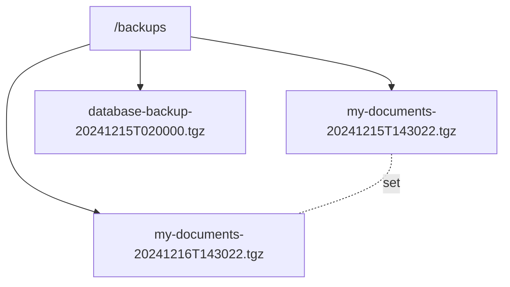

# Backup names

Every backup set has a name. The name identifies the set in the logs and groups
its files. ezbak adds a timestamp to each file, so each backup is unique.

## The filename format

A backup file is named `{name}-{timestamp}.tgz`:

```
my-documents-20241215T143022.tgz
database-backup-20241215T020000.tgz
```

The timestamp uses the format `YYYYMMDDTHHMMSS`: a four-digit year, a two-digit
month and day, the letter `T`, then two-digit hours, minutes, and seconds. The
`list` command prints this exact timestamp for each backup. You can pass it
directly to a point-in-time restore.

## The name groups a backup set

ezbak matches backups by name, so several backup sets can share one storage
location without a collision. A prune or a restore for `my-documents` never
touches the files named for `database-backup`.


```mermaid
graph TD
  S["/backups"]
  S --> A["my-documents-20241215T143022.tgz"]
  S --> B["my-documents-20241216T143022.tgz"]
  S --> C["database-backup-20241215T020000.tgz"]
  A -.set.- B
```

Set the same `name` on each cooperating task, so they operate on one set. In the
[orchestration pattern](../orchestration/index.md), the sidecar, post-stop, and
pre-start tasks share a name. The pre-start restore then finds the backups the
other two wrote.

## Timestamps and the timezone

The timestamp records the moment ezbak created the backup, in the configured
timezone. In a container, set the timezone with the `TZ` environment variable. To
override the system timezone, set the `tz` option (`EZBAK_TZ`) instead. When
neither is set, ezbak uses the system timezone of the host. See
[Environment variables](../reference/environment-variables.md).

!!! tip "Duplicate names get a unique suffix"

    When two backups produce the same filename, ezbak adds a short unique suffix.
    One backup never overwrites the other, so a name collision cannot lose a
    backup.
