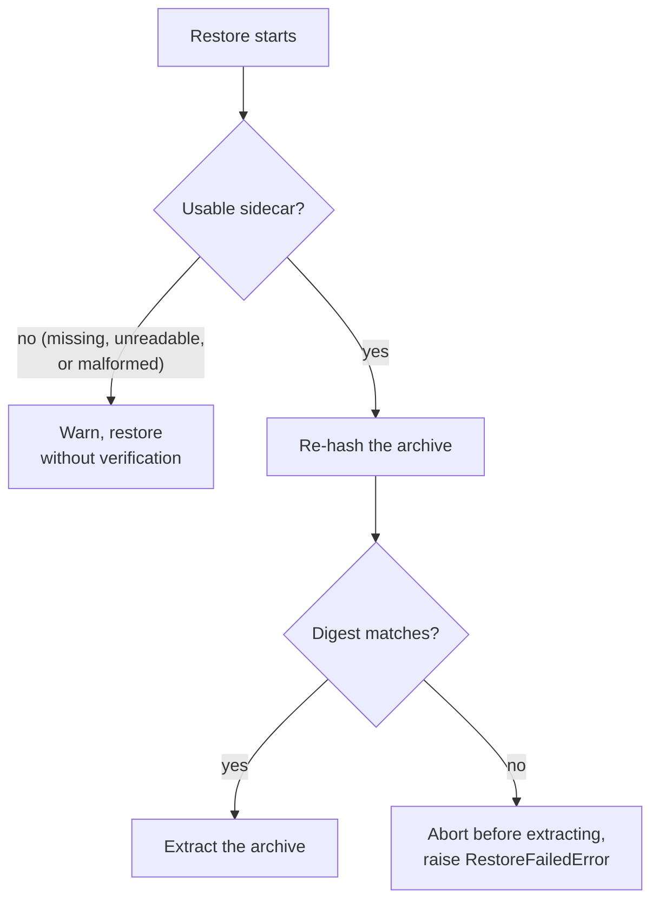

# Archive integrity checksums

ezbak fingerprints every archive it writes and stores that fingerprint in a
small file next to the backup. On restore it re-checks the archive against the
fingerprint, so a corrupt or truncated backup is caught before anything is
extracted.

This matters most in the workflow ezbak is built for. A pre-start task on a new
host downloads the latest archive from S3 and stages it before the job starts.
The checksum catches a bad download before the job comes up on top of broken
state.

## What the sidecar is

Next to each archive, ezbak writes a companion file with the same name plus a
`.sha256` extension. This companion is the checksum sidecar.

```text title="my-documents-20241215T143022.tgz.sha256"
9f86d081884c7d659a2feaa0c55ad015a3bf4f1b2b0b822cd15d6c15b0f00a08  my-documents-20241215T143022.tgz
```

The content is one line in the same format the `sha256sum` tool produces: the
hex digest, two spaces, then the archive filename. ezbak computes the digest
once from the finished archive and stores that identical value on every
destination, so each copy carries its own independently checkable fingerprint.

!!! info "Two things named \"sidecar\""

    In the orchestration docs, a **sidecar** is the container task that takes
    backups on a schedule. Here, a **checksum sidecar** is the `.sha256` file
    that rides alongside an archive. They are unrelated. This page is only about
    the checksum file.

## When ezbak writes one

Every new backup gets a sidecar when `use_checksums` is enabled, which is the
default. Turn it off, per run, to skip generating them:

```bash
ezbak --name my-backup --storage ~/Backups create --source ~/data --no-use-checksums
```

Writing a sidecar is best-effort. If the sidecar write fails, ezbak logs a
warning and keeps the backup rather than failing the whole run. A backup can
therefore exist without a sidecar, and restore handles that case.

## How restore uses it

With `use_checksums` enabled, ezbak looks for the archive's sidecar before
restoring, re-hashes the archive, and compares the two digests. The check runs
before the restore path is touched, so a corrupt archive is rejected up front
and never extracted. With `use_checksums` off, ezbak skips this step and does
not read the sidecar at all.



| Sidecar in storage | What ezbak does |
| --- | --- |
| Present, digest matches | Restores normally |
| Present, digest differs | Aborts before extracting and raises `RestoreFailedError` |
| Missing, unreadable, or malformed | Logs a warning and restores without verification |

A mismatch is treated as corruption, not a soft problem: the archive is never
extracted. A missing or unusable sidecar degrades to a warning, because a
checksum is an added safeguard, not a requirement for restoring a backup that
already exists.

`use_checksums` governs both directions. With it enabled (the default), ezbak
writes a sidecar for each new backup and verifies an archive against its sidecar
on restore. Set it to `false` and ezbak does neither: it writes no new sidecars,
and a restore ignores any sidecar already in storage instead of verifying it.

## Verify a backup yourself

Because the sidecar uses the `sha256sum` format, any machine with coreutils can
check an archive without ezbak. Run the check from the directory holding both
files:

```bash
sha256sum -c my-documents-20241215T143022.tgz.sha256
```

A match prints `OK`. A mismatch prints `FAILED` and exits non-zero.

## How sidecars fit the rest of ezbak

A sidecar is bookkeeping for its archive, so ezbak keeps it out of the way of
everything that operates on backups:

- Retention never counts a sidecar as a backup, so a `.sha256` file cannot be
  pruned in place of a real archive and does not affect any keep rule.
- The `list` command shows archives only, never their sidecars.
- Deleting or pruning a backup removes its sidecar in the same step, on local
  storage and in S3.

Backups created before checksums existed have no sidecar. They restore normally,
with a warning that the run could not verify them.

See [Configuration reference](../reference/configuration.md) for the
`use_checksums` field, flag, and environment variable, and
[Restore backups](../guides/restore.md) for the restore workflow.
