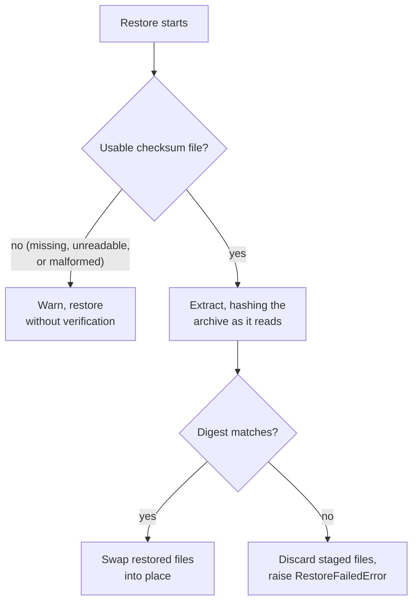

# Archive integrity checksums

ezbak computes a SHA-256 digest of every archive it writes. It stores that digest
in a small file next to the backup. During a restore, ezbak verifies the archive
against the stored digest. A corrupt or truncated backup fails the restore before
it replaces your data.

This matters most in the workflow ezbak is built for. A pre-start task on a new
host downloads the latest archive from S3 and stages it before the job starts.
The checksum catches a bad download before the job comes up on top of broken
state.

## What the checksum file is

Next to each archive, ezbak writes a companion file with the same name plus a
`.sha256` extension. This companion is the checksum file.

```text title="my-documents-20241215T143022.tgz.sha256"
9f86d081884c7d659a2feaa0c55ad015a3bf4f1b2b0b822cd15d6c15b0f00a08  my-documents-20241215T143022.tgz
```

The content is one line in the format the `sha256sum` tool produces: the hex
digest, two spaces, then the archive filename. ezbak computes the digest once
from the finished archive. It stores that identical value on every storage
location, so each copy carries its own digest that you can verify on its own.

## When ezbak writes one

Every new backup gets a checksum file when `use_checksums` is enabled, which is
the default. To skip the checksum file for one run, turn the option off:

```bash
ezbak --name my-backup --storage ~/Backups create --source ~/data --no-use-checksums
```

Writing a checksum file is best-effort. If the write fails, ezbak logs a warning
and keeps the backup instead of failing the whole run. A backup can therefore
exist without a checksum file, and a restore handles that case.

## How restore uses it

With `use_checksums` enabled, ezbak looks for the checksum file of the archive.
It then hashes the archive as it extracts it and compares the two digests. A
restore extracts into a staging directory and swaps that directory into place
only on success (see [Restore
failures](failure-behavior.md#restore-failures-and-clean-before-restore)). A
digest mismatch stops the restore before that swap, so the corrupt archive never
reaches your data. With `use_checksums` off, ezbak skips this step and does not
read the checksum file at all.


```mermaid
graph TD
  R["Restore starts"] --> Q{"Usable checksum file?"}
  Q -->|"no (missing, unreadable,<br/>or malformed)"| W["Warn, restore<br/>without verification"]
  Q -->|yes| H["Extract, hashing the<br/>archive as it reads"]
  H --> C{"Digest matches?"}
  C -->|yes| OK["Swap restored files<br/>into place"]
  C -->|no| F["Discard staged files,<br/>raise RestoreFailedError"]
```

| Checksum file in storage | What ezbak does |
| --- | --- |
| Present, digest matches | Restores normally |
| Present, digest differs | Fails before the swap and raises `RestoreFailedError` |
| Missing, unreadable, or malformed | Logs a warning and restores without verification |

ezbak treats a mismatch as corruption, not as a soft problem. The restore fails
and leaves your existing data untouched. A missing or unusable checksum file
degrades to a warning, because a checksum is an added safeguard. It is not a
requirement for restoring a backup that already exists.

`use_checksums` governs both directions. With the option enabled (the default),
ezbak writes a checksum file for each new backup and verifies an archive against
its checksum file on restore. Set it to `false` and ezbak does neither. It writes
no new checksum files, and a restore ignores any checksum file already in
storage.

## Verify a backup yourself

The checksum file uses the `sha256sum` format, so any machine with coreutils can
verify an archive without ezbak. Run this command from the directory that holds
both files:

```bash
sha256sum -c my-documents-20241215T143022.tgz.sha256
```

A match prints `OK`. A mismatch prints `FAILED` and exits non-zero.

## How checksum files fit the rest of ezbak

A checksum file is bookkeeping for its archive. ezbak keeps it out of the way of
everything that operates on backups:

- Retention never counts a checksum file as a backup. A `.sha256` file cannot be
  pruned in place of a real archive, and it does not affect any keep rule.
- The `list` command prints only archives, never their checksum files.
- A delete or a prune of a backup also deletes its checksum file, in the same
  step, on local storage and in S3.

Backups created before checksums existed have no checksum file. They restore
normally, with a warning that the run cannot verify them.

For the `use_checksums` field, flag, and environment variable, see the
[Configuration reference](../reference/configuration.md). For the restore
workflow, see [Restore backups](../guides/restore.md).
