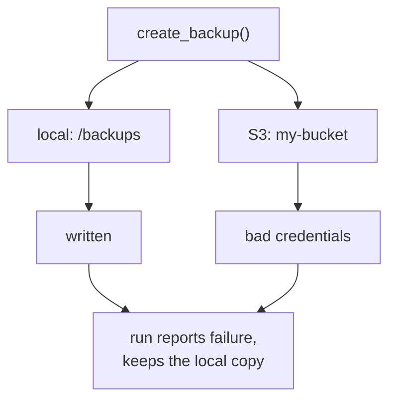

# Failure behavior

A backup tool that reports success when it failed is worse than one that fails
loudly. ezbak never lets a failed backup or restore look like a success. How it
signals a failure depends on which interface you use.

## Partial success is kept, not discarded

A backup run writes to each storage location independently. If one location
fails, ezbak still writes to every location that works, then reports the failure.
You keep the copies that succeeded.



The library carries the detail on the raised error: `BackupFailedError` names the
`failed_storage_locations` and attaches the `created_backups` that did land.

## How each interface signals failure

The same failure surfaces three ways.

=== "Library"

    `create_backup()` raises `BackupFailedError`; `restore_backup()` raises
    `RestoreFailedError`. `restore_backup()` returns `False` when there is simply
    no backup to restore, which is not an error. Catch `EZBakError` to handle any
    failure.

    ```python
    from ezbak.exceptions import EZBakError

    try:
        backups.create_backup()
    except EZBakError as error:
        print(f"Backup failed: {error}")
    ```

=== "CLI"

    `ezbak create` and `ezbak restore` exit non-zero on failure and log the
    reason. A restore that finds no backup exits non-zero too, unless you pass
    `--if-exists`.

=== "Container (one-shot)"

    A one-shot run (`EZBAK_ACTION` without `EZBAK_CRON`) exits non-zero on
    failure, the same as the CLI. An orchestrator sees the exit code.

=== "Container (scheduled)"

    A scheduled run (`EZBAK_CRON`) logs the error and keeps running, so the next
    scheduled run retries. It pings the failure endpoint when
    `EZBAK_HEALTHCHECK_URL` is set. See [Monitoring](../orchestration/monitoring.md).

## Restore failures and clean-before-restore

A restore fails loudly when ezbak cannot download, read, or extract the archive.
It raises `RestoreFailedError` instead of failing silently, so a failure is never
mistaken for a successful restore.

The restore is atomic. ezbak extracts the archive into a staging directory inside
the restore path and swaps it into the target only after the extract succeeds.
With `clean_before_restore`, the target is emptied as part of that final swap, so
a download, read, or extract failure leaves the existing contents in place.

!!! note "A failed swap preserves the extracted files"

    The one point where the target can be left partial is the final swap itself,
    for example when the disk fills mid-swap. If that happens, ezbak keeps the
    extracted files in a `.ezbak-restore-*` directory inside the target so you can
    recover them by hand, and it still raises `RestoreFailedError`.

## The "nothing to restore" case

A missing backup is different from a failed restore. When there is no backup to
restore, `restore_backup()` returns `False` and raises nothing. The CLI and
container turn that result into an exit code:

- Without `restore_if_exists`, no backup is a failure and the exit code is
  non-zero.
- With `restore_if_exists`, no backup is a clean no-op and the exit code is zero.

This distinction is what lets a pre-start restore run on a fresh deployment that
has no backup yet. See [Fresh deploys](../orchestration/fresh-deploys.md).
