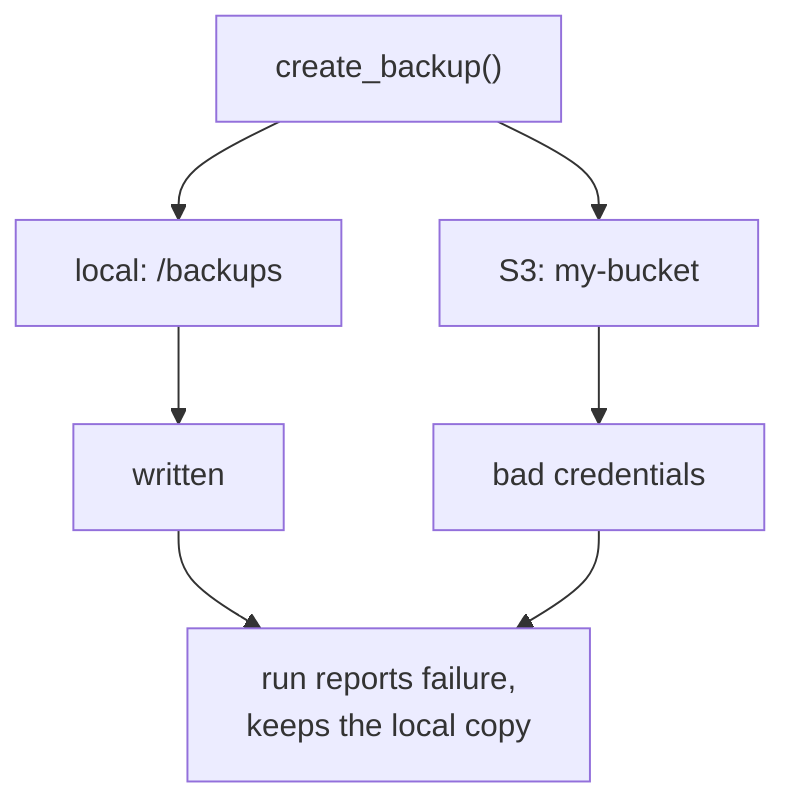

# Failure behavior

A backup tool that reports success when it failed is worse than one that fails
loudly. ezbak never lets a failed backup or restore look like a success. How it
signals a failure depends on which interface you use.

## Partial success is kept, not discarded

A backup run writes to each storage location independently. If one location
fails, ezbak still writes to every location that works, then reports the failure.
You keep the copies that succeeded.


```mermaid
graph TD
  C["create_backup()"] --> L["local: /backups"]
  C --> S["S3: my-bucket"]
  L --> OK["written"]
  S --> BAD["bad credentials"]
  OK --> R["run reports failure,<br/>keeps the local copy"]
  BAD --> R
```

The library carries the detail on the raised error: `BackupFailedError` names the
`failed_storage_locations` and attaches the `created_backups` that did land.

## An unreadable destination is not an empty one

ezbak distinguishes "this destination holds no backups" from "this destination
could not be read." A permission error, a network failure, or an unreachable
bucket is a failure, not an empty result, and it never gets silently absorbed
into an empty inventory.

The backup run above already treats a bad destination this way: it fails and
exits non-zero rather than reporting success. The same distinction carries
through the rest of ezbak:

- A backup run still writes the archive to a destination it could not read,
  then fails the run and names it. Listing a destination and writing to it are
  separate requests, so a listing that fails on a destination ezbak already
  reached is no reason to withhold the archive.
- A restore fails with `RestoreFailedError` rather than reporting that no
  backup matched.
- A prune skips the unreadable destination and logs an error, leaving its
  archives untouched. Destinations that are still reachable prune normally.
- `ezbak list` prints the backups it did find, then names the unreadable
  destinations and exits non-zero, instead of reporting "No backups found."
  See the [CLI reference](../reference/cli.md#list).

!!! warning "skip_if_no_backup does not cover an unreachable destination"

    `skip_if_no_backup` exists so a first deployment with no backup yet can
    still start. It applies only when a destination is readable and
    genuinely empty. If a destination cannot be read, the restore fails
    regardless of `skip_if_no_backup`, and the job does not start.

    This is deliberate. Starting a job with no data when a backup does exist
    lets the next scheduled backup capture the empty state, and retention
    eventually discards the good archive.

!!! note "Restore is all-or-nothing across destinations"

    With both a local path and an S3 bucket configured, one unreadable
    destination fails the restore, even though the healthy destination could
    have served it. Restoring an older archive while a possibly newer
    destination is unreadable would silently stage stale state, so ezbak
    fails instead of guessing which destination is authoritative.

A library caller can check `EZBak.unreadable_locations` before trusting
`list_backups()`: a non-empty list means the inventory is incomplete, and a
backup missing from the list may still exist somewhere unreadable. See the
[Python API reference](../reference/python-api.md#unreadable_locations).

## How each interface signals failure

The same failure surfaces three ways.

=== "Library"

    `create_backup()` raises `BackupFailedError`; `restore_backup()` raises
    `RestoreFailedError`. `restore_backup()` returns `RestoreOutcome.NO_BACKUP`
    when there is simply no backup to restore, and
    `RestoreOutcome.SKIPPED_POPULATED` when it declines to overwrite a populated
    target; neither is an error. Catch `EZBakError` to handle any failure.

    ```python
    from ezbak.exceptions import EZBakError

    try:
        backups.create_backup()
    except EZBakError as error:
        print(f"Backup failed: {error}")
    ```

=== "CLI"

    `ezbak create` and `ezbak restore` exit non-zero on failure and log the
    reason. A restore that finds no backup exits non-zero too, unless you pass
    `--skip-if-no-backup`. `ezbak list` exits non-zero if a destination could
    not be read, instead of reporting that no backups exist.

=== "Container (one-shot)"

    A one-shot run (`EZBAK_ACTION` without `EZBAK_CRON`) exits non-zero on
    failure, the same as the CLI. An orchestrator sees the exit code. It also
    pings the failure endpoint when `EZBAK_HEALTHCHECK_URL` is set. See
    [Monitoring](../orchestration/monitoring.md).

=== "Container (scheduled)"

    A scheduled run (`EZBAK_CRON`) logs the error and keeps running, so the next
    scheduled run retries. It pings the failure endpoint when
    `EZBAK_HEALTHCHECK_URL` is set. See [Monitoring](../orchestration/monitoring.md).

## Restore failures and clean-before-restore

A restore fails loudly when ezbak cannot download, read, or extract the archive.
It raises `RestoreFailedError` instead of failing silently, so a failure is never
mistaken for a successful restore.

The restore is atomic. ezbak extracts the archive into a staging directory inside
the restore path and swaps it into the target only after the extract succeeds.
With `clean_before_restore`, the target is emptied as part of that final swap, so
a download, read, or extract failure leaves the existing contents in place.

!!! note "A failed swap preserves the extracted files"

    The one point where the target can be left partial is the final swap itself,
    for example when the disk fills mid-swap. If that happens, ezbak keeps the
    extracted files in a `.ezbak-restore-*` directory inside the target so you can
    recover them by hand, and it still raises `RestoreFailedError`.

## Checksum verification on restore

With `use_checksums` enabled (the default), a checksum mismatch aborts the
restore with `RestoreFailedError` and leaves the target untouched, so a corrupt
archive never replaces your data. A missing or unreadable sidecar logs a warning
and restores without verification.

See [Archive integrity checksums](checksums.md) for how sidecars are written,
verified, and checked by hand.

## The "nothing to restore" case

A missing backup is different from a failed restore. When there is no backup to
restore, `restore_backup()` returns `RestoreOutcome.NO_BACKUP` and raises
nothing. The CLI and container turn that result into an exit code:

- Without `skip_if_no_backup`, no backup is a failure and the exit code is
  non-zero.
- With `skip_if_no_backup`, no backup is a clean no-op and the exit code is zero.

This distinction is what lets a pre-start restore run on a fresh deployment that
has no backup yet. See [Fresh deploys](../orchestration/fresh-deploys.md).

## The "target already has data" case

A populated target is also not a failure. When `skip_restore_if_populated` is
set and the target already contains data, `restore_backup()` returns
`RestoreOutcome.SKIPPED_POPULATED`, logs an info message, and exits zero, again
without running the post-restore hook. `clean_before_restore` bypasses this
guard, since emptying the target and restoring into it is an explicit replace.
See [Restore backups](../guides/restore.md).
