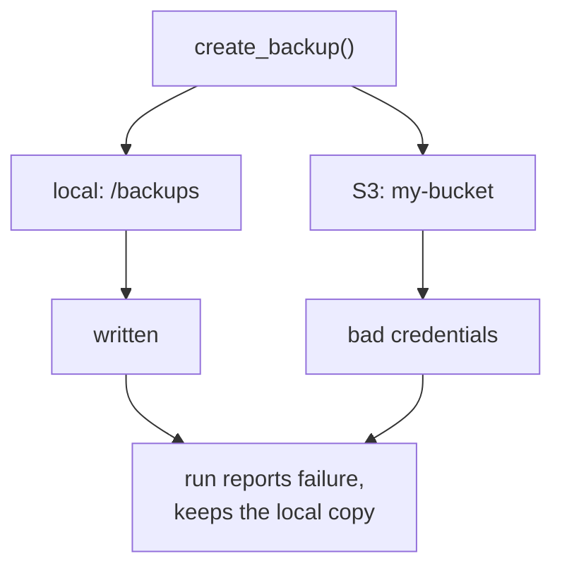

# Failure behavior

A backup tool that reports success after it failed is worse than one that fails
loudly. ezbak never lets a failed backup or restore look like a success. The
interface you use decides how ezbak signals the failure.

## Partial success is kept, not discarded

A backup run writes to each storage location independently. If one location
fails, ezbak still writes to every location that works, then reports the failure.
You keep the copies that succeeded.


```mermaid
graph TD
  C["create_backup()"] --> L["local: /backups"]
  C --> S["S3: my-bucket"]
  L --> OK["written"]
  S --> BAD["bad credentials"]
  OK --> R["run reports failure,<br/>keeps the local copy"]
  BAD --> R
```

The library carries the detail on the raised error. `BackupFailedError` names the
`failed_storage_locations` and attaches the `created_backups` that did land.

## An unreadable storage location is not an empty one

ezbak separates "this location holds no backups" from "this location cannot be
read". A permission error, a network failure, or an unreachable bucket is a
failure, not an empty result. ezbak never absorbs it into an empty inventory.

The backup run above already treats a bad location this way. It fails and exits
non-zero instead of reporting success. The same distinction carries through the
rest of ezbak:

- A backup run still writes the archive to a location it cannot read. It then
  fails the run and names that location. A listing and a write are separate
  requests, so a failed listing is no reason to withhold the archive from a
  location ezbak already reached.
- A restore raises `RestoreFailedError` instead of reporting that no backup
  matched.
- A prune skips the unreadable location and logs an error, and it leaves the
  archives there untouched. Locations that are still reachable prune normally.
- `ezbak list` prints the backups it did find, then names the unreadable
  locations and exits non-zero, instead of reporting "No backups found". See the
  [CLI reference](../reference/cli.md#list).

!!! warning "skip_if_no_backup does not cover an unreachable location"

    `skip_if_no_backup` exists so a first deployment with no backup yet can still
    start. It applies only when a location is readable and genuinely empty. If a
    location cannot be read, the restore fails whatever `skip_if_no_backup` is
    set to, and the job does not start.

    This is deliberate. A job that starts with no data, while a backup does
    exist, is dangerous. The next scheduled backup captures the empty state, and
    retention eventually deletes the good archive.

!!! note "Restore is all-or-nothing across locations"

    With both a local path and an S3 bucket configured, one unreadable location
    fails the restore, even though the healthy location can serve it. A restore
    of an older archive, while a possibly newer location is unreadable, stages
    stale state without a word. ezbak fails instead of guessing which location is
    authoritative.

A library caller can read `EZBak.unreadable_locations` before it trusts
`list_backups()`. A non-empty list means the inventory is incomplete, and a
backup absent from the list can still exist in a location ezbak cannot read.
See the [Python API reference](../reference/python-api.md#unreadable_locations).

## How each interface signals failure

The same failure surfaces differently on each interface.

=== "Library"

    `create_backup()` raises `BackupFailedError`, and `restore_backup()` raises
    `RestoreFailedError`. `restore_backup()` returns `RestoreOutcome.NO_BACKUP`
    when there is no backup to restore. It returns
    `RestoreOutcome.SKIPPED_POPULATED` when it declines to overwrite a populated
    target. Neither result is an error. Catch `EZBakError` to handle any failure.

    ```python
    from ezbak.exceptions import EZBakError

    try:
        backups.create_backup()
    except EZBakError as error:
        print(f"Backup failed: {error}")
    ```

=== "CLI"

    `ezbak create` and `ezbak restore` exit non-zero on failure and log the
    reason. A restore that finds no backup also exits non-zero, unless you pass
    `--skip-if-no-backup`. `ezbak list` exits non-zero when a location cannot be
    read, instead of reporting that no backups exist.

=== "Container (one-shot)"

    A one-shot run (`EZBAK_ACTION` without `EZBAK_CRON`) exits non-zero on
    failure, the same as the CLI. An orchestrator sees the exit code. The run
    also pings the failure endpoint when `EZBAK_HEALTHCHECK_URL` is set. See
    [Monitoring](../orchestration/monitoring.md).

=== "Container (scheduled)"

    A scheduled run (`EZBAK_CRON`) logs the error and keeps running, so the next
    scheduled run retries. It pings the failure endpoint when
    `EZBAK_HEALTHCHECK_URL` is set. See [Monitoring](../orchestration/monitoring.md).

## Restore failures and clean-before-restore

A restore fails loudly when ezbak cannot download, read, or extract the archive.
It raises `RestoreFailedError` instead of failing silently, so you never mistake
a failure for a successful restore.

The restore is atomic. ezbak extracts the archive into a staging directory inside
the restore path. It swaps that directory into the target only after the extract
succeeds. With `clean_before_restore`, ezbak empties the target as part of that
final swap, so a failed download, read, or extract leaves the existing contents
in place.

!!! note "A failed swap preserves the extracted files"

    The final swap is the one point where the target can be left partial, for
    example when the disk fills. ezbak then keeps the extracted files in a
    `.ezbak-restore-*` directory inside the target, so you can recover them by
    hand. It still raises `RestoreFailedError`.

## Checksum verification on restore

With `use_checksums` enabled (the default), a checksum mismatch stops the restore
with `RestoreFailedError` and leaves the target untouched. A corrupt archive
never replaces your data. A missing or unreadable checksum file logs a warning,
and the restore runs without verification.

See [Archive integrity checksums](checksums.md) for how ezbak writes and verifies
a checksum file, and how you verify one by hand.

## The "nothing to restore" case

A missing backup is different from a failed restore. When there is no backup to
restore, `restore_backup()` returns `RestoreOutcome.NO_BACKUP` and raises
nothing. The CLI and the container turn that result into an exit code:

- Without `skip_if_no_backup`, no backup is a failure and the exit code is
  non-zero.
- With `skip_if_no_backup`, no backup is a clean no-op and the exit code is zero.

This distinction is what lets a pre-start restore run on a fresh deployment that
has no backup yet. See [Fresh deploys](../orchestration/fresh-deploys.md).

## The "target already has data" case

A populated target is also not a failure. When `skip_restore_if_populated` is set
and the target already holds data, `restore_backup()` returns
`RestoreOutcome.SKIPPED_POPULATED`, logs an info message, and exits zero. Again
it does not run the post-restore hook. `clean_before_restore` bypasses this
guard, because a clean restore is an explicit replace. See
[Restore backups](../guides/restore.md).
