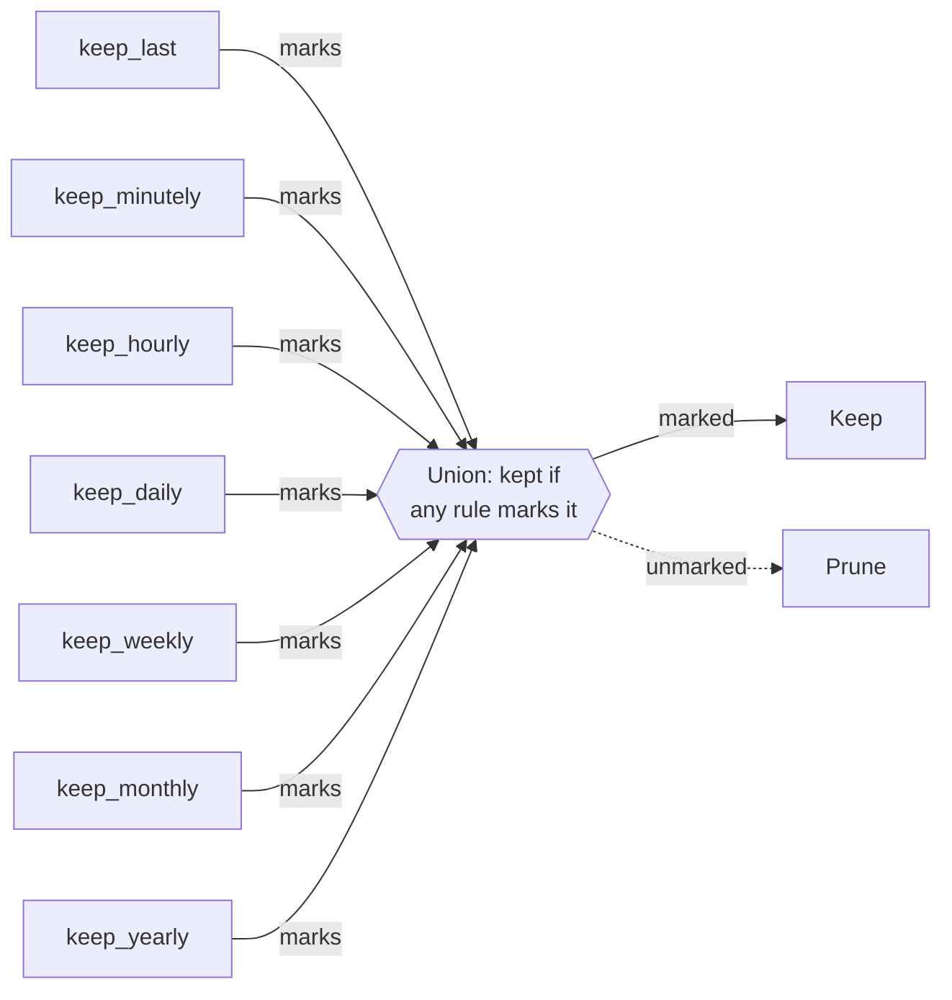

# Retention policies

Backups accumulate. A retention policy decides which ones to keep and which ones
to prune.

The retention policy of ezbak is a set of independent keep rules. If any rule
marks a backup, that backup survives the prune. There is no mode to choose. Set
the rules you want, and ezbak takes the union of the result.

## How rules combine

Each rule marks a subset of your backups. ezbak prunes a backup only when no rule
marks it.



## The keep rules

Seven rules are available. You set each one independently:

| Rule | Marks |
| --- | --- |
| `keep_last` | The N most recent backups overall |
| `keep_minutely` | The newest backup in each of the last N minutes that has one |
| `keep_hourly` | The newest backup in each of the last N hours that has one |
| `keep_daily` | The newest backup in each of the last N days that has one |
| `keep_weekly` | The newest backup in each of the last N weeks that has one |
| `keep_monthly` | The newest backup in each of the last N months that has one |
| `keep_yearly` | The newest backup in each of the last N years that has one |

A rule that you leave unset, or set to `0`, marks nothing. Only the rules you set
contribute to the union.

```python
from pathlib import Path
from ezbak import EZBak, BackupConfig

EZBak(
    BackupConfig(
        name="my-backup",
        source_paths=[Path("/data")],
        storage_paths=[Path("/backups")],
        keep_daily=7,
        keep_yearly=2,
    )
)
```

On the command line, this is `prune --keep-daily 7 --keep-yearly 2`. In the
environment it is `EZBAK_KEEP_DAILY` and `EZBAK_KEEP_YEARLY`. For the field, the
flag, and the environment variable of every rule, see the
[configuration reference](../reference/configuration.md).

## Rules overlap, so counts are not additive

Two rules that mark the same backup do not count it twice. A sidecar that backs
up every hour, with `keep_last=5` and `keep_daily=10` set, keeps 14 backups, not
15:

- `keep_last=5` marks the 5 most recent backups, all from the last few hours.
- `keep_daily=10` marks the newest backup from each of the last 10 days that has
  one, including today.

The two sets overlap by exactly one backup. The newest backup of today is both
the single most recent backup overall and the daily representative of today. The
union is 5 plus 10, minus that one shared backup: 14 in total.

## Defaults

Leave every rule unset, and ezbak keeps everything. ezbak deletes a backup only
when at least one rule is active and no active rule marks that backup.

## ezbak refuses to empty a location

When every rule you set is `0`, the policy marks nothing and the prune deletes
every backup in the storage location. ezbak treats this as a mistake rather than
an instruction.

!!! warning "ezbak refuses to delete everything"

    If a policy marks no backup in a storage location, ezbak logs an error and
    skips that location. It keeps every backup there and raises no error. Set at
    least one rule to a positive value, or leave all rules unset to keep
    everything.

## When pruning runs

A prune is a separate step from a backup.

- The `ezbak prune` command runs it on demand.
- The `prune_backups()` method runs it from your code.
- A scheduled container prunes automatically after each backup run.

To preview a prune, use a dry run. It reports the target files and deletes
nothing:

```bash
ezbak --name my-backup --storage ~/Backups prune --keep-daily 7 --keep-weekly 4 --dry-run
```
