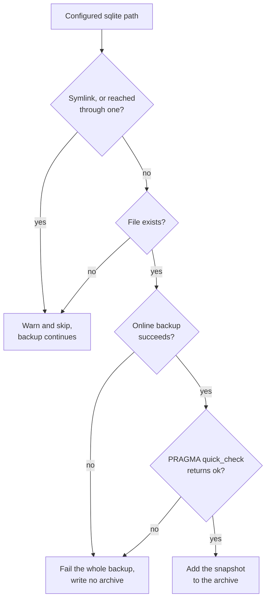

# SQLite databases

Archiving a SQLite database while a service is writing to it can produce a backup
that will not open. List the database in `sqlite_paths` and ezbak copies it
through SQLite's own online-backup API instead of reading the file, so the
archive holds a consistent point-in-time copy.

This matters most in the workflow ezbak is built for. A sidecar takes backups
while the job keeps running, so the database is open and being written the whole
time the archive is created.

## Why a file copy is unsafe

ezbak walks your source tree and reads each file as it finds it. A database the
service has open can change under that read, and two things go wrong:

- The copy captures a **torn page**: bytes from before a write and bytes from
  after it, in one file. SQLite refuses to open the result, or opens it and
  fails on the corrupt page.
- In WAL mode, committed transactions live in the `-wal` file until a checkpoint
  moves them into the main database. Reading the two files at different instants
  during the walk can pair a database with a `-wal` that no longer belongs to it.
  SQLite may then discard that journal, or replay it against a database it was not
  written for. Either way the copy opens cleanly, passes an integrity check, and
  holds the wrong rows. That is the worse of the two failures, because nothing
  reports it.

`sqlite_paths` removes both problems. The copy is taken through
`sqlite3.Connection.backup()`, which coordinates with SQLite's own locking, so
it's safe against a concurrent writer and folds any WAL or hot rollback journal
into the result. ezbak then reopens each snapshot and runs `PRAGMA quick_check`
before it goes into the archive.

## Configure it

Name each database you want snapshotted. A literal path must sit inside one of
your configured source paths; see [Match databases with a
pattern](#match-databases-with-a-pattern) below for the different rule that
applies to a glob pattern.

=== "Library"

    ```python
    from pathlib import Path
    from ezbak import EZBak, BackupConfig

    EZBak(
        BackupConfig(
            name="gitea",
            source_paths=[Path("/data")],
            storage_paths=[Path("/backups")],
            sqlite_paths=[
                Path("/data/gitea.db"),
                Path("/data/sessions/sessions.db"),
            ],
            keep_last=10,
        )
    ).create_backup()
    ```

=== "CLI"

    ```bash
    ezbak --name gitea --storage /backups create \
      --source /data \
      --sqlite-path /data/gitea.db \
      --sqlite-path /data/sessions/sessions.db
    ```

    Repeat `--sqlite-path` once per database.

=== "Container"

    ```bash
    EZBAK_SOURCE_PATHS=/data
    EZBAK_SQLITE_PATHS=/data/gitea.db,/data/sessions/sessions.db
    ```

    `EZBAK_SQLITE_PATHS` takes a comma-separated list, the same as
    `EZBAK_SOURCE_PATHS`.

A run that snapshots databases says so at `INFO`:

```text
INFO | Snapshotted 2 of 2 configured sqlite databases
```

Repeating the same database in the list is harmless. ezbak deduplicates the
paths, keeping the order you gave, so a database is never snapshotted or
archived twice.

## Match databases with a pattern

A literal path names one database, which works only when you know every
filename ahead of time. A service that shards its state across many databases
with generated names, for example `folder.0001-nhx4yzcl.db` and
`folder.0002-j4dkatqn.db`, can't be listed in a job spec at all: the next shard
gets a name nobody wrote down. Give `sqlite_paths` a glob pattern instead, and
ezbak snapshots every database the pattern matches.

=== "Library"

    ```python
    sqlite_paths=[Path("/data/shards/*.db")]
    ```

=== "CLI"

    ```bash
    ezbak --name shards --storage /backups create \
      --source /data \
      --sqlite-path "/data/shards/*.db"
    ```

=== "Container"

    ```bash
    EZBAK_SOURCE_PATHS=/data
    EZBAK_SQLITE_PATHS=/data/shards/*.db
    ```

### What counts as a pattern

An entry is a pattern when it contains `*`, `?`, or `[`, and no file exists at
that exact path. ezbak checks the filesystem first, so a database genuinely
named `weird[1].db` still works as a literal path: the literal reading wins
whenever the path is real.

That reading is re-decided on every run, not fixed once. If `weird[1].db` is
ever deleted, the same entry classifies as a pattern on the next backup and
may expand to whatever else matches, for example `weird1.db`. The consequence
is narrow: the "database not found" warning you'd otherwise get is lost,
since a match, not an absence, is what the run sees instead.

Two spellings are rejected outright when the config is built, on every
interface:

| Entry | Why it's rejected |
| --- | --- |
| Any entry holding a `..` component, such as `/data/../etc/app.db` | ezbak decides containment without resolving the path, so a `..` looks like it sits inside a source path and then lands in the archive under a name a restore refuses to extract. |
| A pattern where `**` is not a whole path component, such as `/data/**.db` | Python rejects it outright before 3.13 and quietly reads it as a single `*` from 3.13 on, so it would mean different things on different runtimes. Write `/data/**/*.db`. |

### Absolute and relative patterns anchor differently

| Pattern | Anchored at | Reads as |
| --- | --- | --- |
| `/data/shards/*.db` (absolute) | The directory it names | "this exact place" |
| `**/*.db` (relative) | Each configured source path, in turn | "anywhere under my sources" |

A relative pattern is never resolved against the process working directory,
which in a container is whatever the base image happened to set. It's matched
under every path in `source_paths` instead, so `**/*.db` finds a database
under any of them.

`**` recurses through subdirectories and, like every other directory walk in
ezbak, does not follow a symlinked directory.

!!! warning "Root an absolute pattern below the filesystem root"

    A pattern whose first component already globs, such as `/**/*.db`, has no
    static prefix. It anchors at `/` and walks the whole filesystem below it on
    every backup run, which in a container includes `/proc` and `/sys`. Write
    every absolute pattern with a real leading directory, such as
    `/data/**/*.db`.

### Patterns are expanded on every backup run

A literal path is fixed once the config is built. A pattern is expanded fresh
each time ezbak takes a backup, which is the point of the feature for a
long-lived cron sidecar: a database your service creates after the container
started is picked up on the very next scheduled run, with no restart and no
config change.

### The file extension doesn't matter

Whether a match is a SQLite database is decided by reading its header, not its
name. `*.sqlite3`, `*.database`, and even an extensionless pattern like
`shards/*` all work the same way, so write the pattern to match your actual
layout instead of a specific extension.

### What a pattern skips, and why

A pattern match is a candidate, not a promise: the entry describes a shape,
and ezbak decides case by case whether each match belongs in the snapshot
list. A literal path is the opposite. It names one file, so ezbak treats it as
an assertion and fails the run when that file can't be snapshotted.

A match is dropped, and the backup continues, in five cases:

| Match | What happens |
| --- | --- |
| Anything that is not a regular file (a directory, a fifo, a socket, a dangling symlink) | Skipped. Only a regular file can be snapshotted. |
| A journal sibling (`-wal`, `-shm`, `-journal`) | Skipped. The database it belongs to is matched separately and carries the consistent snapshot. |
| Not a SQLite database | Skipped from the snapshot list, then archived as an ordinary file by the normal source walk. |
| Outside exactly one configured source path | Skipped, since ezbak can't place the snapshot at a single position in the archive. |
| A symlink, or reached through one | Skipped later, when snapshotting runs, the same way the source walk treats every other symlink. |

The directory, journal, and non-database skips log at `DEBUG`, visible with
`-v` or `-vv`. The out-of-source-path and symlink skips log at `WARNING`:

```text
WARNING | Skip sqlite pattern match not inside exactly one source path: /data/other/app.db
WARNING | Skip backup of symlink: /data/shards/linked.db
```

A pattern that matches nothing also logs a `WARNING`, and the run continues:

```text
WARNING | Pattern matched no sqlite databases: /data/shards/*.db
```

That's deliberate: a freshly deployed service has no databases yet, and
failing here would break the first backup after every deploy.

!!! warning "A mistyped pattern fails silently"

    None of the checks above catch a typo in the pattern itself. If
    `/data/shards/*.db` should have been `/data/shard/*.db`, ezbak finds
    nothing, logs the warning above, and moves on, because a fresh deployment
    looks identical to a mistyped pattern from the code's point of view. Your
    databases are then archived as ordinary file copies instead of snapshots,
    and a copy taken while the service holds the database open can be torn.

    An absolute pattern rooted at a directory that doesn't exist is rejected
    at startup, before any backup runs, which catches the common version of
    this mistake: a wrong directory in a job spec. It doesn't catch every
    version. A pattern whose directory exists but is simply the wrong one
    passes validation and only shows up as the ordinary-file-copy behavior
    described above. Test a new pattern against a real deployment before
    relying on it.

### A worked example

The motivating case is a sharded service with generated database names:

```bash title=".env"
EZBAK_SOURCE_PATHS=/data
EZBAK_SQLITE_PATHS=/data/state/*.db
```

Every database matching `/data/state/*.db` is snapshotted, including ones
created after the container started, so adding a shard never means updating
the job spec.

## The archive layout does not change

Each snapshot is written into the archive at exactly the position the live
database would have occupied, and the live file is skipped. The `-wal`, `-shm`,
and `-journal` files beside it are left out too, since they belong to the
running database and would contradict the snapshot that replaced it.

The result is an archive identical in shape to one taken of a stopped service:

```text title="tar -tzf gitea-20260731T185220.tgz"
data/notes.txt
data/sessions/
data/gitea.db
data/sessions/sessions.db
```

Each snapshot is appended after the source walk, which is why the two databases
come last. Position in the tar stream doesn't affect where files land on
extraction.

Restores need no special handling. Nothing has to be replayed, renamed, or
merged after extracting, and an existing restore procedure keeps working
unchanged.

### Stale journals at the restore target are cleared

Because the archive carries no `-wal`, `-shm`, or `-journal`, a restore has to
account for the ones that may already be sitting in the target directory. A host
volume that survived a hard-killed job still holds the previous run's uncheckpointed
`-wal`, and SQLite would replay it over the database the restore just put there,
quietly reverting rows and still passing an integrity check.

ezbak removes those files as it commits a restore. A journal is only deleted when
all four hold:

- the archive supplied the file it sits beside, so that file is being replaced anyway,
- that file's header identifies it as a real SQLite database,
- the archive did not supply the journal itself, and
- the journal's own header identifies it as a real SQLite `-wal` or `-journal` (a
  `-shm` is a rebuildable cache, so its name is enough).

Together those keep the removal to files that are unambiguously a live database's
journals. A file that merely happens to be named `notes-wal` survives, and so does
a `notes-shm` sitting beside a `notes` that is not a database at all. Each removal
is logged:

```text
INFO | Removed stale sqlite journal beside restored file: /data/app.db-wal
```

`clean_before_restore` empties the target first and so never encounters the
problem.

!!! info "Sources are still archived normally"

    `sqlite_paths` does not narrow what gets backed up. Every source path is
    archived as usual; the only difference is that the named databases arrive as
    snapshots instead of as file reads.

## Literal paths must sit inside exactly one source path

For literal paths, ezbak places a snapshot by working out where its live file
would have landed, so the path has to resolve to one position. Two configurations
are rejected when the config is constructed, before any backup runs:

| Configuration | Result |
| --- | --- |
| The path is inside no configured source path | `sqlite path '/tmp/app.db' is not inside any configured source path` |
| The path is inside more than one source path (overlapping or nested sources) | `sqlite path '/data/app.db' is inside more than one source path (...)` |

Both fail at construction rather than mid-run: the library raises a pydantic
`ValidationError` from `BackupConfig`, and the CLI logs the message and exits
non-zero before it touches your data.

For pattern entries, containment is instead checked when the pattern is expanded:
an out-of-source match is skipped with a warning rather than rejected at
construction.

## Filters apply to snapshots

`include_regex` and `exclude_regex` are matched against the database's live path,
not the temporary path its snapshot is staged at. A database excluded by your
filters is left out of the archive, exactly as the live file would have been, and
it is never snapshotted in the first place, so it costs no time and no temporary
disk.

```bash
# /data/sessions/sessions.db is dropped by the filter, so it is never snapshotted
ezbak --name gitea --storage /backups create \
  --source /data \
  --sqlite-path /data/sessions/sessions.db \
  --exclude-regex sessions
```

This keeps the archive identical to one taken of a quiesced tree. See
[Including and excluding files](filtering.md) for how the two patterns combine.

## Missing, unreadable, and corrupt databases

A path that doesn't exist is a warning, and so is a path that is a symlink. A
database that exists but cannot be snapshotted fails the entire backup.



```text
WARNING | Configured sqlite database not found, skipping: /data/optional.db
WARNING | Skip backup of symlink: /data/linked.db
```

Skipping a missing file is deliberate. A service may not have created an
optional database yet, and failing there would break the first backup after a
fresh deploy. A symlink is skipped for the reason every other symlink in a source
tree is: ezbak archives what is inside your source paths, and following the link
would copy content from wherever it points. That applies to a directory on the way
to the database too, so `/data/current/app.db` is skipped when `current` is a link.
A database that is present is a different case: if ezbak cannot
copy it consistently, the archive would not be the archive you asked for, so it
writes nothing and reports the failure. See [Failure
behavior](failure-behavior.md) for how each interface signals that.

### A locked database eventually gives up

In WAL mode a snapshot never waits on a writer, so this does not come up. A
rollback-journal database is different: a copy has to wait for the writer's
exclusive lock, and SQLite's own backup call retries forever. ezbak stops waiting
after five minutes and fails the run, so one long-running write transaction cannot
silently wedge a cron sidecar and stop it backing up altogether.

```text
Failed to snapshot sqlite database '/data/app.db': Timed out after 300s waiting to copy '/data/app.db': another process is holding a write lock
```

## Mount the source read-write

!!! warning "Required whenever `sqlite_paths` is set"

    The volume holding your databases must be mounted **read-write**. Every other
    container example in this documentation mounts the source `:ro`, including
    [Running in Docker](../guides/docker.md), the
    [quickstart](../getting-started/quickstart.md),
    [Nomad](../orchestration/nomad.md), and
    [Kubernetes](../orchestration/kubernetes.md). Change that mount when you set
    `sqlite_paths`.

    Reading a WAL database can require creating its `-wal` and `-shm` files, and
    SQLite derives their paths from the database path itself. They cannot be
    redirected to a writable directory elsewhere.

Read-write is also what the service that owns the database already needs, so this
usually means matching the mount the service uses.

A read-only source is not a safe substitute, and the reason is worth knowing
because it will not show up in testing. When `-wal` and `-shm` are already on
disk, which is the case while a service holds the database open, SQLite maps them
and a read-only source works. Closing the last connection checkpoints the
database and deletes both files. The **post-stop backup**, taken after the
service has exited, finds neither file, cannot create them, and fails. A
read-only mount therefore backs up correctly for as long as the service is
running and then fails on the final backup, which is the one you can least afford
to lose.

If you hit this, the run fails with:

```text
Failed to snapshot read-only sqlite database '/data/gitea.db': attempt to write a readonly database
```

ezbak does retry through a read-only connection before giving up. Treat that as a
narrow safety net, not a supported configuration: it cannot help a WAL database
that has no `-shm`, which is exactly the case above.

## Disk usage during a run

ezbak stages each snapshot in its temporary directory before adding it to the
archive, so a run needs room for the databases it actually snapshots plus the
finished archive. A configured path that doesn't exist is skipped and costs
nothing. Snapshots are deleted as soon as the archive is written, whether the run
succeeded or failed.

Two 500 MB databases and a 300 MB archive need 1.3 GB of temporary space. Size
the container's writable layer or its temp volume accordingly.

## What ezbak does not snapshot

SQLite is supported because it is a file on disk, it has stdlib support in
Python, and reading it needs no credentials and no network service. ezbak can
snapshot one with no configuration beyond a path.

Postgres and MySQL are different. Both need an external client binary and
credentials to reach a running server, which would put database secrets into
ezbak's configuration and a client into its image. Dump those with a pre-backup
hook instead, then back up the dump:

```bash
EZBAK_PRE_BACKUP_HOOK='pg_dump -Fc -f /data/app.dump app'
EZBAK_POST_BACKUP_HOOK='rm -f /data/app.dump'
```

See [Container lifecycle hooks](../guides/hooks.md) for the hook points, the
image you need to build to get `pg_dump`, and how to keep credentials out of the
logged command.

## Reference

- [Configuration reference](../reference/configuration.md) for the `sqlite_paths`
  field, its flag, and its environment variable.
- [Restore backups](../guides/restore.md) for restoring an archive that contains
  snapshots, which is the ordinary restore path.
