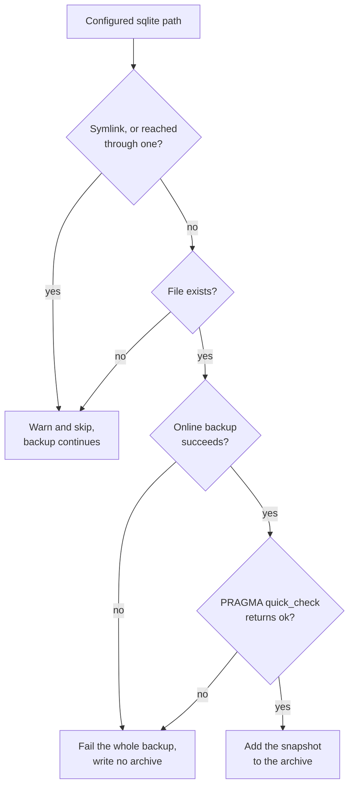

# SQLite databases

A plain file copy of a SQLite database is unsafe while a service writes to it.
List the database in `sqlite_paths` instead. ezbak then copies it through the
online-backup API of SQLite, which is safe against a concurrent writer and folds
in any WAL or rollback journal. ezbak runs `PRAGMA quick_check` on each snapshot
before the snapshot goes into the archive.

This matters most in the workflow ezbak is built for. A sidecar takes backups
while the job runs, so a writer holds the database the whole time.

!!! info "The silent failure is the dangerous one"

    A torn copy fails loudly, because SQLite refuses to open it. A WAL mismatch
    does not. The walk reads the database and its `-wal` at different instants,
    so it can pair a database with a journal that no longer belongs to it. The
    copy then opens, passes an integrity check, and holds the wrong rows.

## Configure it

Name each database you want ezbak to snapshot. A literal path must sit inside
exactly one of your configured source paths, because ezbak writes the snapshot
at the position of the live file.

=== "Library"

    ```python
    from pathlib import Path
    from ezbak import EZBak, BackupConfig

    EZBak(
        BackupConfig(
            name="gitea",
            source_paths=[Path("/data")],
            storage_paths=[Path("/backups")],
            sqlite_paths=[
                Path("/data/gitea.db"),
                Path("/data/sessions/sessions.db"),
            ],
            keep_last=10,
        )
    ).create_backup()
    ```

=== "CLI"

    ```bash
    ezbak --name gitea --storage /backups create \
      --source /data \
      --sqlite-path /data/gitea.db \
      --sqlite-path /data/sessions/sessions.db
    ```

    Repeat `--sqlite-path` once per database.

=== "Container"

    ```bash
    EZBAK_SOURCE_PATHS=/data
    EZBAK_SQLITE_PATHS=/data/gitea.db,/data/sessions/sessions.db
    ```

    `EZBAK_SQLITE_PATHS` takes a comma-separated list, the same as
    `EZBAK_SOURCE_PATHS`.

ezbak rejects three entries when it builds the configuration, before any backup
runs. The library raises a pydantic `ValidationError`. The CLI logs the message
and exits non-zero.

```text
sqlite path '/tmp/app.db' is not inside any configured source path
sqlite path '/data/app.db' is inside more than one source path (...)
sqlite path '/data/../etc/app.db' contains a '..' component
```

A duplicate entry is not an error. ezbak keeps the first occurrence, so it never
archives a database twice. A run that snapshots databases says so at `INFO`:

```text
INFO | Snapshotted 2 of 2 configured sqlite databases
```

## Mount the source read-write

!!! warning "Required whenever `sqlite_paths` is set"

    Mount the volume that holds your databases **read-write**. Every other
    container example in this documentation mounts the source `:ro`, including
    [Running in Docker](../guides/docker.md), the
    [quickstart](../getting-started/quickstart.md),
    [Nomad](../orchestration/nomad.md), and
    [Kubernetes](../orchestration/kubernetes.md). When you set `sqlite_paths`,
    change that mount.

A read of a WAL database can require ezbak to create the `-wal` and `-shm`
files. SQLite derives their paths from the database path itself, so you cannot
redirect them elsewhere. The service that owns the database already needs
read-write access, so this usually means matching the mount that the service
uses.

A read-only source passes a test and then fails where it matters. While the
service runs, `-wal` and `-shm` are already on disk, so the backup works. The
close of the last connection deletes both files. The **post-stop backup** runs
after that, finds neither file, cannot create them, and fails:

```text
Failed to snapshot read-only sqlite database '/data/gitea.db': attempt to write a readonly database
```

ezbak does retry through a read-only connection first. Treat that as a narrow
safety net rather than a supported configuration, because it cannot help a WAL
database that has no `-shm`.

## Match databases with a pattern

A literal path works only when you know every filename in advance. A service can
shard its state across databases with generated names, such as
`folder.0001-nhx4yzcl.db`. Give `sqlite_paths` a glob pattern instead, and ezbak
snapshots every database the pattern matches.

=== "Library"

    ```python
    sqlite_paths=[Path("/data/shards/*.db")]
    ```

=== "CLI"

    ```bash
    ezbak --name shards --storage /backups create \
      --source /data \
      --sqlite-path "/data/shards/*.db"
    ```

=== "Container"

    ```bash
    EZBAK_SOURCE_PATHS=/data
    EZBAK_SQLITE_PATHS=/data/shards/*.db
    ```

ezbak expands a pattern on every backup run. Your service can create a database
after the container started, and the next scheduled run finds it with no restart
and no configuration change.

### How a pattern is read

An entry is a pattern when it contains `*`, `?`, or `[`, and no file exists at
that exact path. ezbak reads the filesystem first, so a database genuinely named
`weird[1].db` still works as a literal path.

| Pattern | Anchored at | Reads as |
| --- | --- | --- |
| `/data/shards/*.db` (absolute) | The directory it names | "this exact place" |
| `**/*.db` (relative) | Each configured source path, in turn | "anywhere under my sources" |

ezbak never resolves a relative pattern against the working directory of the
process, which in a container is whatever the base image set.

Two more rules apply. Write `**` as a whole path component, so `/data/**/*.db`
rather than `/data/**.db`. Give every absolute pattern a real leading directory,
because a pattern such as `/**/*.db` anchors at `/` and walks the whole
filesystem on every run.

The file extension does not matter. ezbak reads the header of each match to
decide whether it is a SQLite database, so `*.sqlite3`, `*.database`, and
`shards/*` all work. `**` recurses through subdirectories, and like every other
walk in ezbak it does not follow a symlinked directory.

### What a pattern skips

A pattern match is a candidate, not a promise. A literal path is the opposite.
It names one file, so ezbak fails the run when it cannot snapshot that file.
ezbak drops a match, and the backup continues, in five cases:

| Match | Why ezbak drops it |
| --- | --- |
| Not a regular file (a directory, a fifo, a socket, a dangling symlink) | Only a regular file can be snapshotted. |
| A journal sibling (`-wal`, `-shm`, `-journal`) | The database it belongs to carries the consistent snapshot. |
| Not a SQLite database | The normal source walk archives it as an ordinary file. |
| Outside exactly one configured source path | ezbak cannot place the snapshot at a single position in the archive. |
| A symlink, or reached through one | The source walk treats every other symlink the same way. |

The first three log at `DEBUG`, visible with `-v` or `-vv`. The last two log at
`WARNING`. A pattern that matches nothing logs a `WARNING` and continues:

```text
WARNING | Pattern matched no sqlite databases: /data/shards/*.db
```

That is deliberate. A freshly deployed service has no databases yet, and a
failure here breaks the first backup after every deploy.

!!! warning "A mistyped pattern fails silently"

    Do a test of every new pattern against a real deployment before you rely on
    it. If you write `/data/shards/*.db` but mean `/data/shard/*.db`, ezbak
    logs the warning above and continues, because a typo and a fresh deployment
    look identical to the code. ezbak then archives your databases as ordinary
    file copies, which can be torn.

    ezbak does reject an absolute pattern rooted at a directory that does not
    exist, at startup, which catches the common version of this mistake. A
    pattern rooted at a directory that exists but is the wrong one passes
    validation.

## The archive layout does not change

ezbak writes each snapshot into the archive at the exact position of the live
database, and skips the live file. It also skips the `-wal`, `-shm`, and
`-journal` files beside it, which contradict the snapshot that replaced the
database.

The result is an archive identical in shape to one taken of a stopped service:

```text title="tar -tzf gitea-20260731T185220.tgz"
data/notes.txt
data/sessions/
data/gitea.db
data/sessions/sessions.db
```

Snapshots are appended after the source walk, so they come last in the listing.
The position in the tar stream does not affect where the files land on
extraction. A restore needs no special handling, and an existing restore
procedure keeps working unchanged.

!!! info "Sources are still archived normally"

    `sqlite_paths` does not narrow what ezbak backs up. It archives every source
    path as usual. The only difference is that the named databases arrive as
    snapshots instead of as file reads.

### Stale journals at the restore target are cleared

The archive carries no `-wal`, `-shm`, or `-journal`, so a restore has to account
for the ones already in the target directory. A host volume that survived a
hard-killed job still holds the uncheckpointed `-wal` of the previous run. SQLite
replays it over the database the restore just wrote, which reverts rows without a
word and still passes an integrity check.

ezbak deletes such a journal as it commits a restore. It deletes one only when
the archive supplied the database beside it, and the headers of both files
identify them as real SQLite files. A file merely named `notes-wal` survives.
ezbak logs each deletion:

```text
INFO | Removed stale sqlite journal beside restored file: /data/app.db-wal
```

`clean_before_restore` empties the target first, so it never meets this problem.

## Filters apply to snapshots

ezbak matches `include_regex` and `exclude_regex` against the live path of the
database, not against the temporary path that stages its snapshot. A database
that your filters exclude stays out of the archive, exactly as the live file
does. ezbak never snapshots it, so it costs no time and no temporary disk. An
`--exclude-regex sessions` therefore drops `/data/sessions/sessions.db` even
when you also pass `--sqlite-path /data/sessions/sessions.db`.

For how the two patterns combine, see
[Including and excluding files](filtering.md).

## Missing, unreadable, and corrupt databases

A path that does not exist gives a warning, and so does a path that is a symlink.
A database that exists but cannot be snapshotted fails the whole backup.



```text
WARNING | Configured sqlite database not found, skipping: /data/optional.db
WARNING | Skip backup of symlink: /data/linked.db
```

The two skips are deliberate. A service can create an optional database later,
and a failure there breaks the first backup after a fresh deploy. A symlink
points outside the source paths, and ezbak archives what is inside them. That
applies to a directory on the way to the database too, so ezbak skips
`/data/current/app.db` when `current` is a link.

A database that is present is a different case. If ezbak cannot copy it
consistently, the archive is not the archive you asked for. ezbak writes nothing
and reports the failure. For how each interface signals that, see
[Failure behavior](failure-behavior.md).

### A locked database eventually times out

In WAL mode a snapshot never waits on a writer, so this case does not occur. A
rollback-journal database is different. The copy has to wait for the exclusive
lock of the writer, and the backup call of SQLite retries forever. ezbak stops
waiting after five minutes and fails the run, so one long write transaction
cannot wedge a cron sidecar.

```text
Failed to snapshot sqlite database '/data/app.db': Timed out after 300s waiting to copy '/data/app.db': another process is holding a write lock
```

## Disk usage during a run

ezbak stages each snapshot in its temporary directory before it adds the snapshot
to the archive. Two 500 MB databases and a 300 MB archive need 1.3 GB of
temporary space. Size the writable layer of the container, or its temporary
volume, to match. ezbak deletes the snapshots as soon as it writes the archive,
whether the run succeeded or failed.

## What ezbak does not snapshot

ezbak supports SQLite because it is a file on disk that Python reads with no
credentials and no network service. Postgres and MySQL both need an external
client binary and credentials to reach a running server. That puts database
secrets into the configuration of ezbak and a client into its image. Dump those
databases with a pre-backup hook instead, then back up the dump:

```bash
EZBAK_PRE_BACKUP_HOOK='pg_dump -Fc -f /data/app.dump app'
EZBAK_POST_BACKUP_HOOK='rm -f /data/app.dump'
```

See [Container lifecycle hooks](../guides/hooks.md) for the hook points, the
image you have to build to get `pg_dump`, and how to keep credentials out of the
logged command.

## Reference

- [Configuration reference](../reference/configuration.md) for the `sqlite_paths`
  field, its flag, and its environment variable.
- [Restore backups](../guides/restore.md) for restoring an archive that contains
  snapshots, which is the ordinary restore path.
