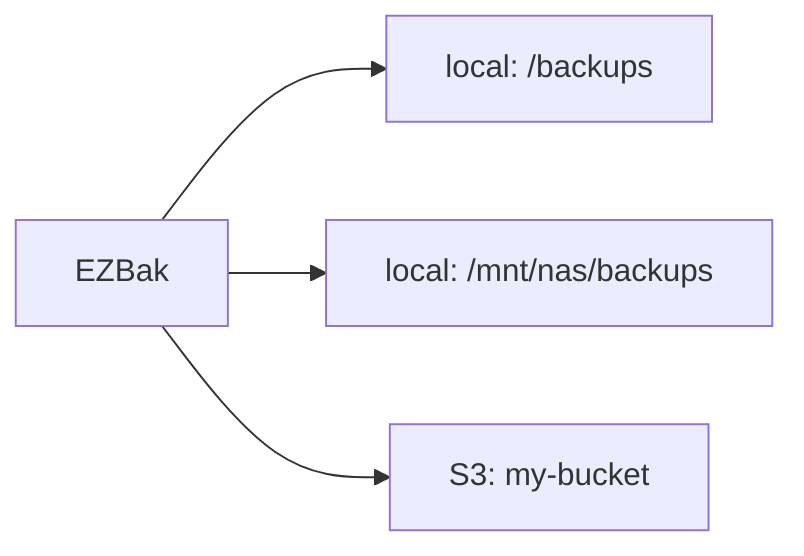

# Storage locations

ezbak sends each backup to the storage locations you configure. There is no
storage-type setting to pick: the locations you provide decide where backups go.

## Local, S3, or both

You configure storage by naming destinations, and the backends follow.

- Set `storage_paths` to back up to one or more local directories.
- Set `aws_s3_bucket_name`, with `aws_access_key` and `aws_secret_key`, to back
  up to S3.
- Set both to write every backup to local storage and S3 at the same time.

At least one storage location is required. A `BackupConfig` with neither
`storage_paths` nor `aws_s3_bucket_name` fails validation.

## Every location gets every backup

A backup run writes the same archive to each configured location. Two local
directories plus a bucket means three copies of each backup. This is how the
[orchestration pattern](../orchestration/index.md) keeps a local copy on the host
and a shared copy in S3 that follows the job to another host.

## When a location cannot be used

If a configured location cannot be used, from bad S3 credentials, an unreachable
bucket, or a local directory ezbak cannot create, the run fails rather than
reporting success. ezbak still writes to every location that works, so a partial
failure keeps the copies that succeeded.

The failure surfaces differently on each interface:

- The library raises `BackupFailedError`.
- The `ezbak create` command and a one-shot container exit non-zero.
- A scheduled container logs the error, pings its failure endpoint, and keeps
  running so the next scheduled run retries.

See [Failure behavior](failure-behavior.md) for the full picture, and
[Back up to S3](../guides/s3.md) for S3 setup.
