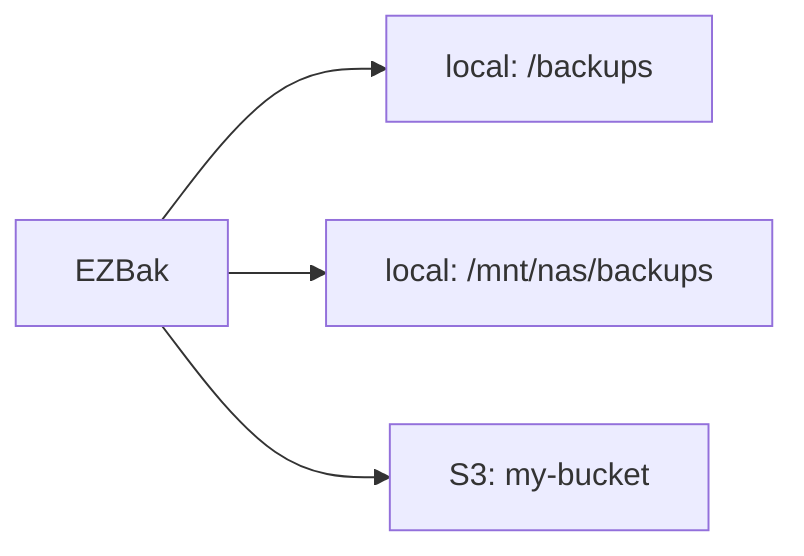

# Storage locations

ezbak sends each backup to the storage locations you configure. There is no
storage-type option to pick. The locations you configure decide where backups go.

## Local, S3, or both

You configure storage by naming the locations, and the backends follow.

- Set `storage_paths` to back up to one or more local directories.
- Set `aws_s3_bucket_name` to back up to S3. Add `aws_access_key` and
  `aws_secret_key` to authenticate explicitly. Omit both to use the credentials
  of the host, such as an EC2 instance profile or an EKS service account.
- Set both to write every backup to local storage and to S3 at the same time.

```mermaid
graph LR
  E["EZBak"] --> L1["local: /backups"]
  E --> L2["local: /mnt/nas/backups"]
  E --> S3["S3: my-bucket"]
```

At least one storage location is required. A `BackupConfig` with neither
`storage_paths` nor `aws_s3_bucket_name` fails validation.

## Every location gets every backup

A backup run writes the same archive to each configured location. Two local
directories plus a bucket means three copies of each backup. This is how the
[orchestration pattern](../orchestration/index.md) works. It keeps a local copy
on the host, and a shared copy in S3 that follows the job to another host.

## When a location cannot be used

A configured location can fail for three reasons: bad S3 credentials, an
unreachable bucket, or a local directory ezbak cannot create. In each case the
run fails instead of reporting success. ezbak still writes to every location that
works, so a partial failure keeps the copies that succeeded.

[Failure behavior](failure-behavior.md) describes how that failure surfaces on
each interface and which errors it raises. For the S3 setup, see
[Back up to S3](../guides/s3.md).
