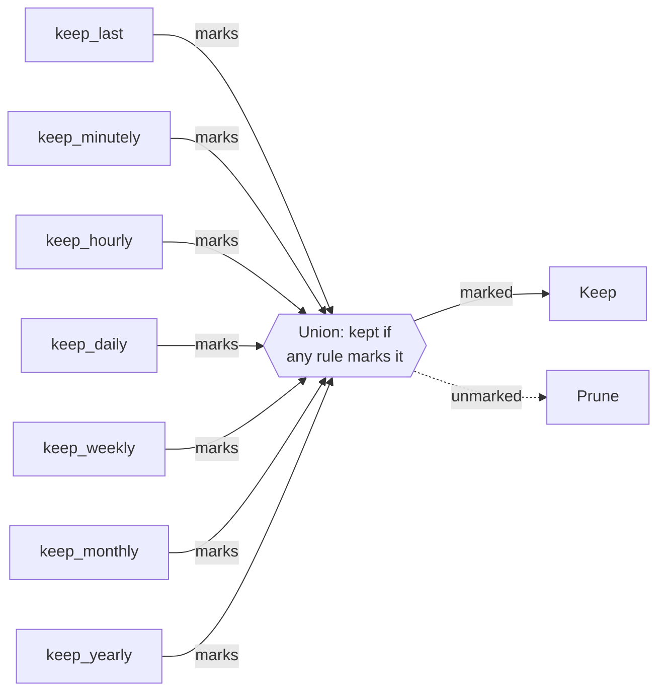

# Retention policies

Backups accumulate. A retention policy decides which ones to keep and which to prune.

ezbak's retention policy is a set of independent keep rules. A backup survives
pruning if any rule marks it. There's no mode to choose: set the rules you want,
and ezbak unions the result.

## How rules combine

Each rule marks a subset of your backups. A backup is pruned only if no rule
marks it.



## The keep rules

Seven rules are available, each set independently:

| Rule | Marks |
| --- | --- |
| `keep_last` | The N most recent backups overall |
| `keep_minutely` | The newest backup in each of the last N minutes that has one |
| `keep_hourly` | The newest backup in each of the last N hours that has one |
| `keep_daily` | The newest backup in each of the last N days that has one |
| `keep_weekly` | The newest backup in each of the last N weeks that has one |
| `keep_monthly` | The newest backup in each of the last N months that has one |
| `keep_yearly` | The newest backup in each of the last N years that has one |

Leave a rule unset, or set it to `0`, and it marks nothing. Only the rules you
set contribute to the union.

```python
from pathlib import Path
from ezbak import EZBak, BackupConfig

EZBak(
    BackupConfig(
        name="my-backup",
        source_paths=[Path("/data")],
        storage_paths=[Path("/backups")],
        keep_daily=7,
        keep_yearly=2,
    )
)
```

On the command line, this is `prune --keep-daily 7 --keep-yearly 2`. In the
environment it's `EZBAK_KEEP_DAILY` and `EZBAK_KEEP_YEARLY`. For the field,
flag, and environment variable names of every rule, see the
[configuration reference](../reference/configuration.md).

## Rules overlap, so counts aren't additive

Rules that mark the same backup don't double it. A sidecar that backs up every
hour, with `keep_last=5` and `keep_daily=10` set, keeps 14 backups, not 15:

- `keep_last=5` marks the 5 most recent backups, all from the last few hours.
- `keep_daily=10` marks the newest backup from each of the last 10 days that
  has one, including today.

The two sets overlap by exactly one backup: today's newest backup is both the
single most recent backup overall and today's daily representative. The union
is 5 + 10 minus that one shared backup, 14 in total.

## Defaults

Leave every rule unset and ezbak keeps everything. Pruning only removes a
backup once at least one rule is active and that backup falls outside all
active rules.

## Refuse to empty a location

An active policy where every set rule is `0` would delete every backup in a
storage location. ezbak treats this as a mistake rather than an instruction.

!!! warning "ezbak refuses to delete everything"

    If a policy would empty a storage location, ezbak logs an error and skips
    pruning that location. It keeps every backup there and does not raise. Set
    at least one rule to a positive value, or leave all rules unset to keep
    everything.

## When pruning runs

Pruning is a separate step from creating a backup.

- The `ezbak prune` command runs it on demand.
- The `prune_backups()` method runs it from your code.
- A scheduled container prunes automatically after each backup run.

Preview before deleting with a dry run, which reports the targets without
removing them:

```bash
ezbak --name my-backup --storage ~/Backups prune --keep-daily 7 --keep-weekly 4 --dry-run
```
