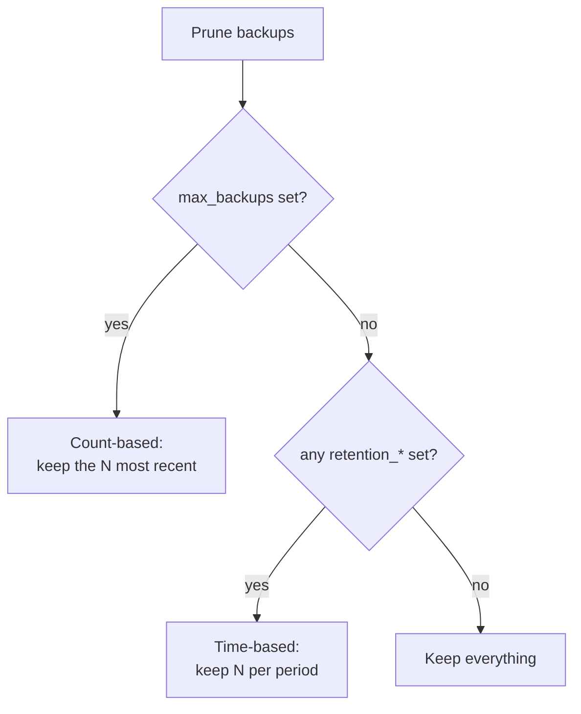

# Retention policies

Backups accumulate. A retention policy decides which to keep and which to prune.
ezbak offers two policies, and you pick one: a simple count, or per-period limits.

## The two policies



The two cannot combine. If `max_backups` is set, the time-based options are
ignored. With no retention option at all, ezbak keeps every backup.

## Count-based: keep the N most recent

Set `max_backups` to keep a fixed number of the newest backups and prune the rest.

```python
from pathlib import Path
from ezbak import EZBak, BackupConfig

EZBak(
    BackupConfig(
        name="my-backup",
        source_paths=[Path("/data")],
        storage_paths=[Path("/backups")],
        max_backups=10,
    )
)
```

On the command line, this is `prune --max-backups 10` (`-x`). In the environment
it is `EZBAK_MAX_BACKUPS`.

## Time-based: keep N per period

Time-based retention keeps a different number of backups for each period. It suits
a schedule where you want fine granularity for recent backups and coarse coverage
further back.

```python
EZBak(
    BackupConfig(
        name="my-backup",
        source_paths=[Path("/data")],
        storage_paths=[Path("/backups")],
        retention_yearly=3,
        retention_monthly=12,
        retention_weekly=4,
        retention_daily=7,
        retention_hourly=24,
        retention_minutely=60,
    )
)
```

The six periods are yearly, monthly, weekly, daily, hourly, and minutely. Set the
ones you want.

!!! info "Unset periods keep one backup"

    Once any time-based option is set, ezbak is in time-based mode, and each
    period you leave unset keeps 1 backup. Leave a period out only when keeping a
    single backup for it is acceptable.

## When pruning runs

Pruning is a separate step from creating a backup.

- The `ezbak prune` command runs it on demand.
- The `prune_backups()` method runs it from your code.
- A scheduled container prunes automatically after each backup run.

Preview before deleting with a dry run, which reports the targets without removing
them:

```bash
ezbak --name my-backup --storage ~/Backups prune --daily 7 --weekly 4 --dry-run
```

For the field, flag, and environment names of every retention option, see the
[configuration reference](../reference/configuration.md).
