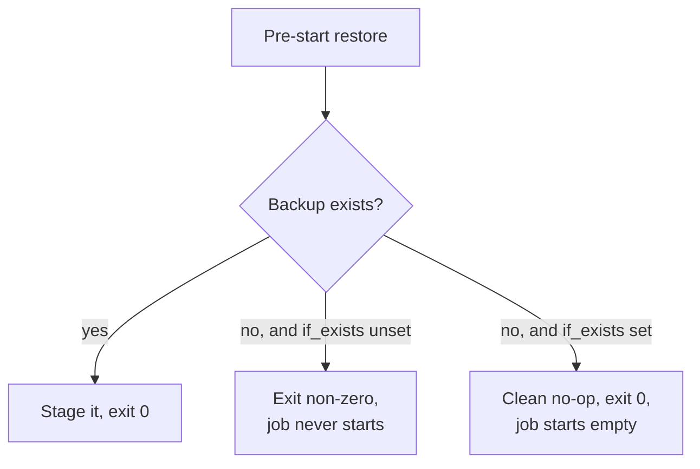

# Fresh deploys

The first time you deploy a job, there is no backup yet. A pre-start restore has
nothing to fetch. Without care, that restore would fail and block the job from
ever starting. The `restore_if_exists` option solves this.

## The problem

The pre-start task restores the latest backup before the job starts. On a fresh
deployment, the backup set is empty, so the restore finds nothing. A restore that
treats "no backup" as a failure would exit non-zero, and the orchestrator would
refuse to start the job. The job could never make its first backup, so it could
never start. A deadlock.



## The fix

Set `EZBAK_RESTORE_IF_EXISTS=true` (CLI `restore --if-exists`) on the pre-start
task. A missing backup becomes a clean no-op that exits zero, so the job starts
with an empty data directory and the sidecar begins taking backups from there.

```bash
docker run -it \
    -v /path/to/data:/data \
    -e EZBAK_ACTION=restore \
    -e EZBAK_NAME=my-service \
    -e EZBAK_AWS_S3_BUCKET_NAME=my-backups \
    -e EZBAK_RESTORE_PATH=/data \
    -e EZBAK_RESTORE_IF_EXISTS=true \
    ghcr.io/natelandau/ezbak:latest
```

The [Nomad](nomad.md) and [Kubernetes](kubernetes.md) examples both set this on
their restore task.

!!! warning "A real failure still fails"

    `restore_if_exists` only changes the "no backup found" case. If a backup
    exists but cannot be downloaded or extracted, the restore still fails and
    exits non-zero, so a genuine problem is never hidden. See [Failure
    behavior](../concepts/failure-behavior.md).

## Why the library does not need this

A Python caller gets the same information from the return value:
`restore_backup()` returns `False` when there is nothing to restore, and the
caller decides what to do. `restore_if_exists` exists so the CLI and container can
turn that result into an exit code an orchestrator understands.
