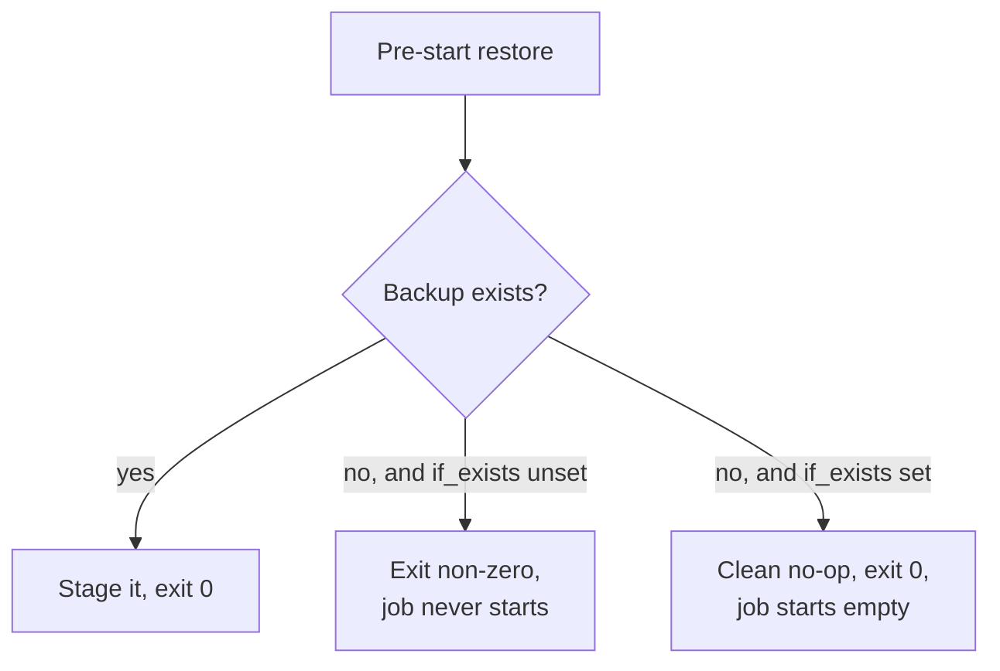
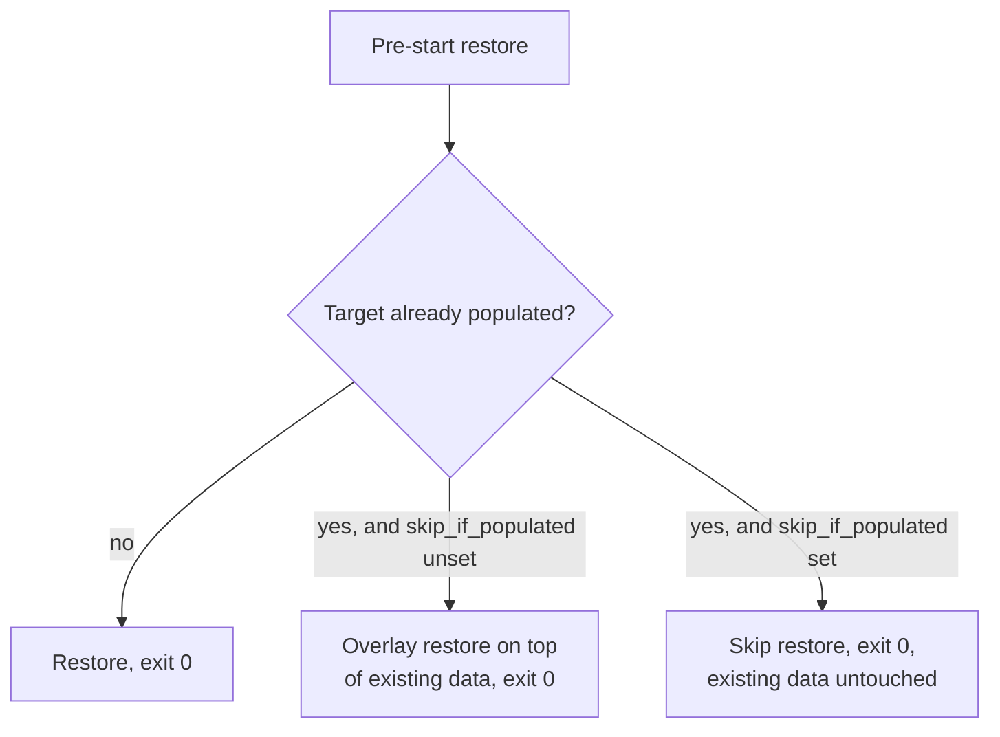

# Fresh deploys

The first time you deploy a job, there is no backup yet. A pre-start restore has
nothing to fetch. Without care, that restore would fail and block the job from
ever starting. The `restore_if_exists` option solves this.

A pre-start restore can also run into the opposite problem: a backup does
exist, but the target already holds data, for example from a job that
restarted without losing its volume. `skip_restore_if_populated` covers that
case. The two options guard different edges of the same pre-start restore and
are commonly set together.

## The problem

The pre-start task restores the latest backup before the job starts. On a fresh
deployment, the backup set is empty, so the restore finds nothing. A restore that
treats "no backup" as a failure would exit non-zero, and the orchestrator would
refuse to start the job. The job could never make its first backup, so it could
never start. A deadlock.



## The fix

Set `EZBAK_RESTORE_IF_EXISTS=true` (CLI `restore --if-exists`) on the pre-start
task. A missing backup becomes a clean no-op that exits zero, so the job starts
with an empty data directory and the sidecar begins taking backups from there.

```bash
docker run -it \
    -v /path/to/data:/data \
    -e EZBAK_ACTION=restore \
    -e EZBAK_NAME=my-service \
    -e EZBAK_AWS_S3_BUCKET_NAME=my-backups \
    -e EZBAK_RESTORE_PATH=/data \
    -e EZBAK_RESTORE_IF_EXISTS=true \
    ghcr.io/natelandau/ezbak:latest
```

The [Nomad](nomad.md) and [Kubernetes](kubernetes.md) examples both set this on
their restore task.

!!! warning "A real failure still fails"

    `restore_if_exists` only changes the "no backup found" case. If a backup
    exists but cannot be downloaded or extracted, the restore still fails and
    exits non-zero, so a genuine problem is never hidden. See [Failure
    behavior](../concepts/failure-behavior.md).

## The other edge: a target that already has data

A pre-start restore assumes it is filling an empty volume. That assumption
breaks when the volume already holds live data, for example after an
orchestrator restarts the job in place without recreating the volume. Restoring
over that data would overlay an older snapshot on top of current state.

Set `EZBAK_SKIP_RESTORE_IF_POPULATED=true` (CLI `restore --skip-if-populated`)
on the same pre-start task to guard against this. If the target already
contains data, ezbak skips the restore and exits zero, leaving the existing
files untouched.



```bash
docker run -it \
    -v /path/to/data:/data \
    -e EZBAK_ACTION=restore \
    -e EZBAK_NAME=my-service \
    -e EZBAK_AWS_S3_BUCKET_NAME=my-backups \
    -e EZBAK_RESTORE_PATH=/data \
    -e EZBAK_RESTORE_IF_EXISTS=true \
    -e EZBAK_SKIP_RESTORE_IF_POPULATED=true \
    ghcr.io/natelandau/ezbak:latest
```

Setting both options on the pre-start task covers both edges: a missing backup
no longer blocks the first deploy, and an already-populated target is never
overlaid on a later one. See [Restore backups](../guides/restore.md) for what
counts as "populated" and how `clean_before_restore` bypasses the guard.

## Why the library does not need these options

A Python caller gets the same information from the return value.
`restore_backup()` returns `RestoreOutcome.NO_BACKUP` when there is nothing to
restore, and `RestoreOutcome.SKIPPED_POPULATED` when it declined to overwrite an
already-populated target. The caller decides what to do with either result.
`restore_if_exists` and `skip_restore_if_populated` exist so the CLI and
container can turn those same results into an exit code an orchestrator
understands.
