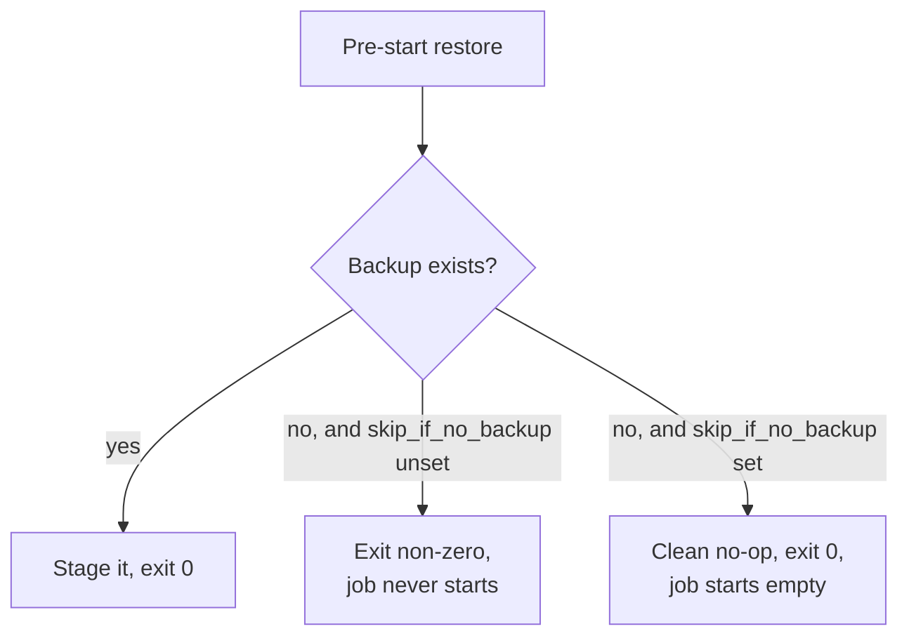
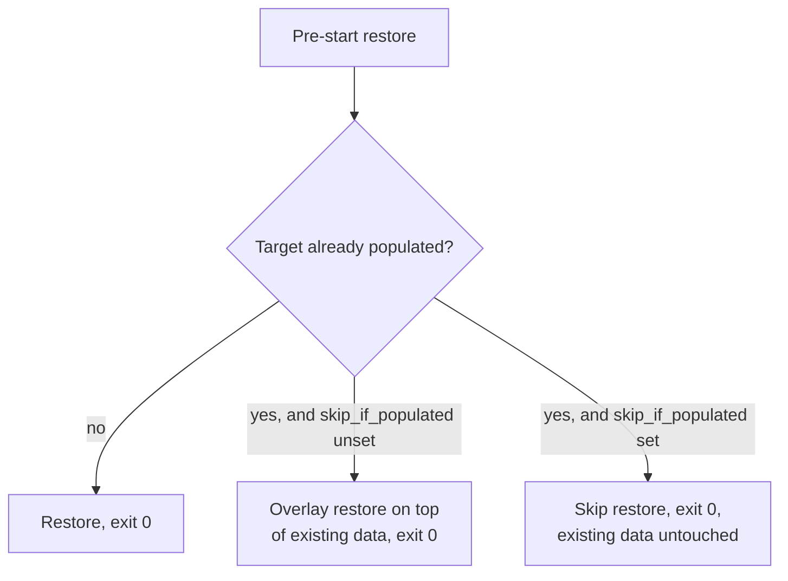

# Fresh deploys

The first time you deploy a job, there is no backup yet. A pre-start restore has
nothing to fetch. Without care, that restore fails and blocks the job from
starting at all. The `skip_if_no_backup` option solves this.

A pre-start restore can also meet the opposite problem. A backup does exist, but
the target already holds data, for example from a job that restarted and kept its
volume. `skip_restore_if_populated` covers that case. The two options guard
different edges of the same pre-start restore, and you commonly set them
together.

## The problem

The pre-start task restores the latest backup before the job starts. On a fresh
deployment, the backup set is empty, so the restore finds nothing. A restore that
treats "no backup" as a failure exits non-zero, and the orchestrator refuses to
start the job. The job can then never make its first backup, so it can never
start. That is a deadlock.


```mermaid
graph TD
  A["Pre-start restore"] --> B{"Backup exists?"}
  B -->|yes| C["Stage it, exit 0"]
  B -->|no, and skip_if_no_backup unset| D["Exit non-zero,<br/>job never starts"]
  B -->|no, and skip_if_no_backup set| E["Clean no-op, exit 0,<br/>job starts empty"]
```

## The fix

Set `EZBAK_SKIP_IF_NO_BACKUP=true` (CLI `restore --skip-if-no-backup`) on the
pre-start task. A missing backup then becomes a clean no-op that exits zero. The
job starts with an empty data directory, and the sidecar begins to take backups
from there.

```bash
docker run -it \
    -v /path/to/data:/data \
    -e EZBAK_ACTION=restore \
    -e EZBAK_NAME=my-service \
    -e EZBAK_AWS_S3_BUCKET_NAME=my-backups \
    -e EZBAK_RESTORE_PATH=/data \
    -e EZBAK_SKIP_IF_NO_BACKUP=true \
    ghcr.io/natelandau/ezbak:latest
```

The [Nomad](nomad.md) and [Kubernetes](kubernetes.md) examples both set this on
their restore task.

!!! warning "A real failure still fails"

    `skip_if_no_backup` changes only the "no backup found" case. It does not
    cover a storage location ezbak cannot read. An unreachable bucket, or a
    permission error, still fails the restore and exits non-zero. So does a
    backup that exists but cannot be downloaded or extracted. ezbak never hides a
    genuine problem behind an empty result. See [An unreadable storage location
    is not an empty
    one](../concepts/failure-behavior.md#an-unreadable-storage-location-is-not-an-empty-one).

## The other edge: a target that already has data

A pre-start restore assumes an empty volume. That assumption breaks when the
volume already holds live data, for example after an orchestrator restarts the
job in place and keeps the volume. A restore over that data overlays an older
snapshot on top of current state.

Set `EZBAK_SKIP_RESTORE_IF_POPULATED=true` (CLI `restore --skip-if-populated`)
on the same pre-start task to guard against this. If the target already holds
data, ezbak skips the restore, exits zero, and leaves the existing files
untouched.


```mermaid
graph TD
  A["Pre-start restore"] --> B{"Target already populated?"}
  B -->|no| C["Restore, exit 0"]
  B -->|yes, and skip_if_populated unset| D["Overlay restore on top<br/>of existing data, exit 0"]
  B -->|yes, and skip_if_populated set| E["Skip restore, exit 0,<br/>existing data untouched"]
```

```bash
docker run -it \
    -v /path/to/data:/data \
    -e EZBAK_ACTION=restore \
    -e EZBAK_NAME=my-service \
    -e EZBAK_AWS_S3_BUCKET_NAME=my-backups \
    -e EZBAK_RESTORE_PATH=/data \
    -e EZBAK_SKIP_IF_NO_BACKUP=true \
    -e EZBAK_SKIP_RESTORE_IF_POPULATED=true \
    ghcr.io/natelandau/ezbak:latest
```

Set both options on the pre-start task to cover both edges. A missing backup then
no longer blocks the first deploy, and ezbak never overlays an already-populated
target on a later one. See [Restore backups](../guides/restore.md) for what
counts as "populated", and for how `clean_before_restore` bypasses the guard.

## Why the library does not need these options

A Python caller gets the same information from the return value.
`restore_backup()` returns `RestoreOutcome.NO_BACKUP` when there is nothing to
restore. It returns `RestoreOutcome.SKIPPED_POPULATED` when it declined to
overwrite an already-populated target. The caller decides what to do with either
result. `skip_if_no_backup` and `skip_restore_if_populated` exist so the CLI and
the container can turn those same results into an exit code an orchestrator
understands.
