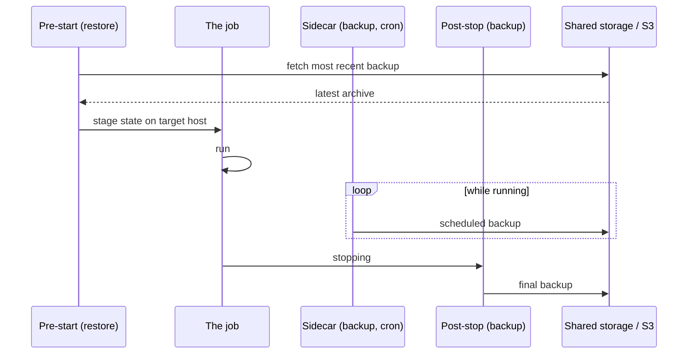

# The orchestration pattern

ezbak exists to move shared state between hosts. A job owns some state, a database
volume, a cache, or uploaded files, and runs under an orchestrator that can place
it on any host. ezbak makes the backup follow the job, so a restart or a move to a
new host comes up with the state already in place.

This is the workflow ezbak is designed around. The container is the primary
interface, and this section shows the full setup.

## Three tasks around one job

The canonical deployment runs the same container image as three cooperating tasks:

- A **sidecar** takes backups on a cron schedule while the job runs.
- A **post-stop** task takes one final backup before the orchestrator tears the
  job down.
- A **pre-start** task fetches the most recent backup and stages it on the target
  host before the job starts.

Point every task at the same S3 bucket, or shared storage, and set the same
`EZBAK_NAME` so they operate on one backup set. The backups then follow the job
wherever the orchestrator places it.

## Why each task uses the settings it does

Each task is the same image with a different `EZBAK_ACTION` and cron setting.

| Task | `EZBAK_ACTION` | `EZBAK_CRON` | Role |
| --- | --- | --- | --- |
| Sidecar | `backup` | set | Periodic backups while the job runs. |
| Post-stop | `backup` | unset | One final backup, then exit. |
| Pre-start | `restore` | unset | Stage the latest backup, then exit. |

The sidecar keeps `EZBAK_CRON` set so it stays up and backs up on a schedule. The
post-stop and pre-start tasks leave cron unset, so each runs once and exits with a
status code the orchestrator can act on.

## Read next

-   :material-server: __Nomad__

    ---

    A complete Nomad jobspec with all three tasks.

    [:octicons-arrow-right-24: Nomad example](nomad.md)

-   :material-kubernetes: __Kubernetes__

    ---

    The same pattern as an init container, sidecar, and preStop hook.

    [:octicons-arrow-right-24: Kubernetes example](kubernetes.md)

-   :material-rocket-launch-outline: __Fresh deploys__

    ---

    Let a pre-start restore skip cleanly when no backup exists yet.

    [:octicons-arrow-right-24: Fresh deploys](fresh-deploys.md)

-   :material-heart-pulse: __Monitoring__

    ---

    Get alerted when a scheduled backup fails or stops running.

    [:octicons-arrow-right-24: Monitoring](monitoring.md)

