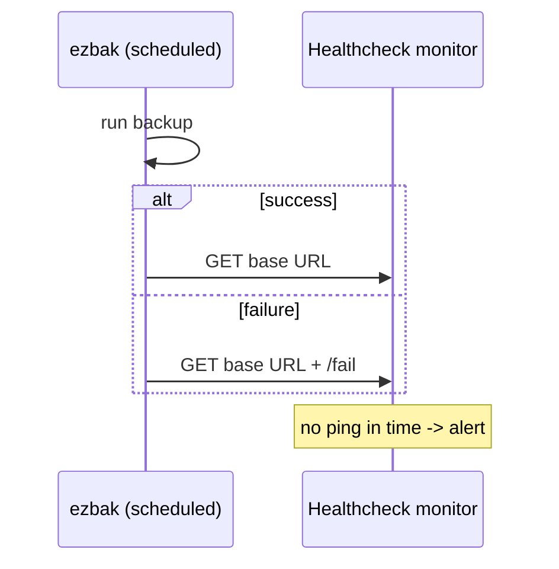

# Monitoring scheduled runs

A scheduled backup that fails quietly is a backup tool's worst failure mode: you
find out only when you need the backup that was never made. ezbak pings a
healthcheck monitor after every scheduled run, so a silent failure gets noticed.

## How the ping works

Set `EZBAK_HEALTHCHECK_URL` on a scheduled container. After each run, ezbak pings
that URL:

- On success, it pings the base URL.
- On failure, it pings the URL with `/fail` appended.

Point the URL at a monitor like [Healthchecks.io](https://healthchecks.io), which
alerts you when an expected ping does not arrive or when a failure ping does. That
catches both a run that failed and a container that stopped running altogether.



## Setup

```bash
docker run -d \
    --name ezbak-scheduled \
    --restart unless-stopped \
    -v /path/to/source:/source:ro \
    -v /path/to/backups:/backups \
    -e EZBAK_ACTION=backup \
    -e EZBAK_NAME=my-backup \
    -e EZBAK_SOURCE_PATHS=/source \
    -e EZBAK_STORAGE_PATHS=/backups \
    -e EZBAK_KEEP_LAST=7 \
    -e EZBAK_CRON="0 2 * * *" \
    -e EZBAK_HEALTHCHECK_URL=https://hc-ping.com/your-uuid \
    ghcr.io/natelandau/ezbak:latest
```

!!! note "Scheduled runs are jittered by up to 10 minutes"

    ezbak adds a random delay of up to 10 minutes to each scheduled run, so the
    ping arrives up to 10 minutes after the cron time. Size your monitor's grace
    period to cover the jitter plus the backup's own runtime.

## What it does and does not cover

The ping applies only to scheduled runs. A one-shot container reports its result
through its exit code instead, which the orchestrator already sees.

!!! info "Monitoring never breaks the backup"

    The ping runs after the backup and never blocks or fails it. If the monitor is
    unreachable, ezbak logs a warning and moves on. A monitoring outage never
    turns a good backup into a failed one.

!!! warning "Scheduled failures are logged, not raised"

    A scheduled run catches its own errors so the container keeps running for the
    next attempt. That means a failure shows up as a failure ping and a log line,
    not a stopped container. The healthcheck monitor is how you find out. Note too
    that APScheduler routes a scheduled job's own errors through Python's standard
    logging, so ezbak catches them and re-logs through its normal log sink to keep
    them visible.
