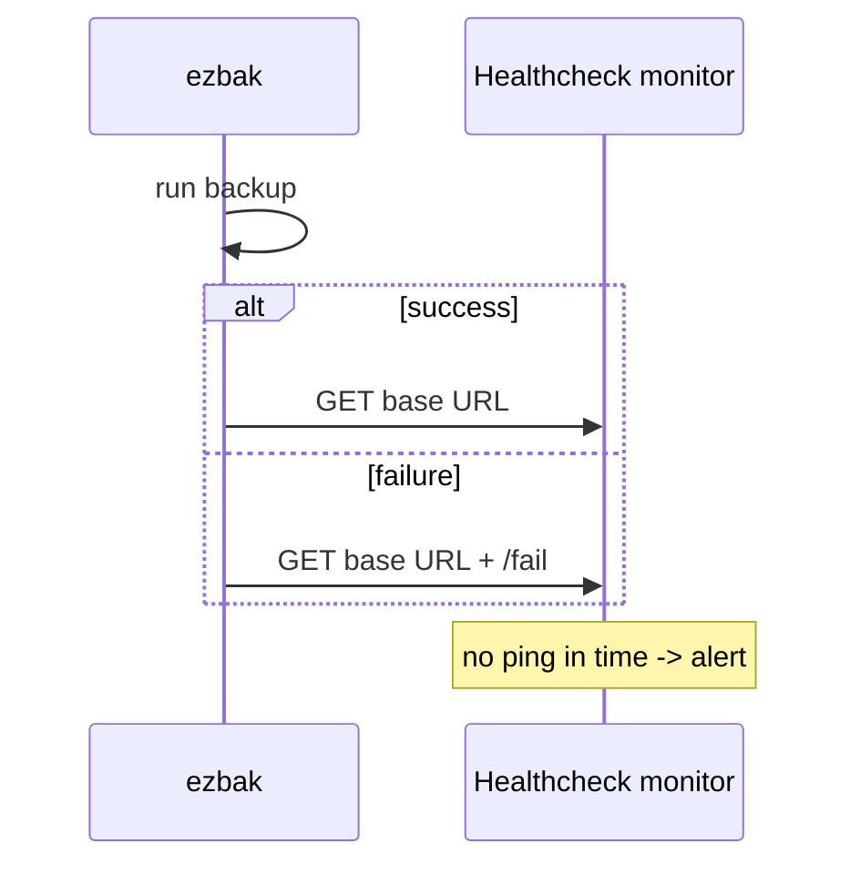

# Monitoring runs

The worst failure mode of a backup tool is a backup that fails silently. You
learn about it only when you need the backup that nobody made. ezbak pings a
healthcheck monitor after every run, so you learn about a failure.

## How the ping works

Set `EZBAK_HEALTHCHECK_URL` on any container. After each run, ezbak pings that
URL:

- On success, it pings the base URL.
- On failure, it pings the URL with `/fail` appended.

Point the URL at a monitor such as [Healthchecks.io](https://healthchecks.io). It
alerts you when an expected ping does not arrive, and when a failure ping does.
That catches both a run that failed and a container that stopped running
altogether.


```mermaid
sequenceDiagram
    participant E as ezbak
    participant M as Healthcheck monitor
    E->>E: run backup
    alt success
        E->>M: GET base URL
    else failure
        E->>M: GET base URL + /fail
    end
    Note over M: no ping in time -> alert
```

## Setup

```bash
docker run -d \
    --name ezbak-scheduled \
    --restart unless-stopped \
    -v /path/to/source:/source:ro \
    -v /path/to/backups:/backups \
    -e EZBAK_ACTION=backup \
    -e EZBAK_NAME=my-backup \
    -e EZBAK_SOURCE_PATHS=/source \
    -e EZBAK_STORAGE_PATHS=/backups \
    -e EZBAK_KEEP_LAST=7 \
    -e EZBAK_CRON="0 2 * * *" \
    -e EZBAK_HEALTHCHECK_URL=https://hc-ping.com/your-uuid \
    ghcr.io/natelandau/ezbak:latest
```

!!! note "Scheduled runs are jittered"

    ezbak adds a random delay of up to 60 seconds to each scheduled run. The ping
    therefore arrives up to 60 seconds after the cron time. Size the grace period of
    your monitor to cover the jitter plus the runtime of the backup. To tune the
    spread, set `EZBAK_CRON_JITTER` (seconds).

## What it covers

Every run pings, scheduled or one-shot. That includes the post-stop backup and
the pre-start restore in an orchestrated deployment, so a failure in either is
visible without reading the container logs.

A one-shot container also reports its result through its exit code, which the
orchestrator already sees. A failed run exits non-zero and pings `/fail`. A
container that never reaches a run exits non-zero and pings nothing. That happens
when the configuration is invalid, or when `EZBAK_ACTION` is unset. The exit code
therefore stays the broader signal.

!!! info "Monitoring never breaks the backup"

    The ping runs after the backup, and it never blocks or fails the backup. If
    the monitor is unreachable, ezbak logs a warning and continues. An outage of
    the monitor never turns a good backup into a failed one.

!!! warning "Scheduled failures are logged, not raised"

    A scheduled run catches its own errors, so the container keeps running for
    the next attempt. A failure therefore shows up as a failure ping and a log
    line, not as a stopped container. The healthcheck monitor is how you learn
    about it.

    APScheduler routes the errors of a scheduled job through the standard logging
    of Python. ezbak catches those errors and logs them again through its normal
    log sink, so they stay visible.
