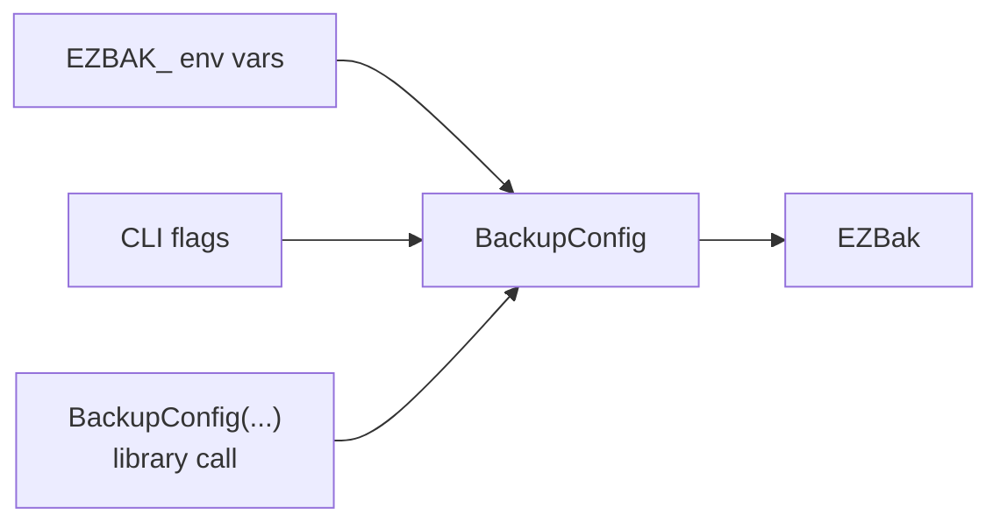

# Configuration reference

Every ezbak option lives on one schema: the `BackupConfig` model. The library
takes a `BackupConfig` directly, the container reads the same fields from
`EZBAK_`-prefixed environment variables, and the CLI maps its own flags onto
them. This page lists every option, its default, and its name on all three
surfaces.

## How the three surfaces map

Each `BackupConfig` field is also an environment variable: uppercase the field
name and add the `EZBAK_` prefix, so `source_paths` becomes `EZBAK_SOURCE_PATHS`.
The CLI uses its own flag names, which do not always match the field name, and a
few flags sit on a subcommand rather than the top-level command.

Three details follow from this design:

- Some options have no CLI flag and are read only from the environment
  (`aws_access_key`, `aws_secret_key`, `tz`). Credentials stay out of your shell
  history this way.
- Some options apply only to the container (`cron`, `EZBAK_ACTION`,
  `healthcheck_url`). See the [environment variables](environment-variables.md)
  reference.
- At least one storage location is required: set `storage_paths`,
  `aws_s3_bucket_name`, or both.

## Identity and sources

| Field | Environment variable | CLI flag | Default |
| --- | --- | --- | --- |
| `name` | `EZBAK_NAME` | `-n`, `--name` | required |
| `source_paths` | `EZBAK_SOURCE_PATHS` | `create --source` | none |

`name` identifies the backup set and groups its files. `source_paths` lists the
files and directories to archive. Pass multiple sources by repeating `--source`
on the command line, or as a comma-separated string in the environment variable.

## Storage

| Field | Environment variable | CLI flag | Default |
| --- | --- | --- | --- |
| `storage_paths` | `EZBAK_STORAGE_PATHS` | `--storage` | none |
| `aws_s3_bucket_name` | `EZBAK_AWS_S3_BUCKET_NAME` | `--s3-bucket` | `None` |
| `aws_s3_bucket_prefix` | `EZBAK_AWS_S3_BUCKET_PREFIX` | `--s3-bucket-prefix` | `None` |
| `aws_access_key` | `EZBAK_AWS_ACCESS_KEY` | environment only | `None` |
| `aws_secret_key` | `EZBAK_AWS_SECRET_KEY` | environment only | `None` |

The storage locations you set decide where backups go. There is no
storage-type selector. See [Storage locations](../concepts/storage-locations.md)
for the model and [Back up to S3](../guides/s3.md) for the S3 setup.

## Backup behavior

| Field | Environment variable | CLI flag | Default |
| --- | --- | --- | --- |
| `compression_level` | `EZBAK_COMPRESSION_LEVEL` | `create -c`, `--compression-level` | `9` |
| `strip_source_paths` | `EZBAK_STRIP_SOURCE_PATHS` | `create -s`, `--strip-source-paths` | `False` |
| `delete_source_after_backup` | `EZBAK_DELETE_SOURCE_AFTER_BACKUP` | environment only | `False` |
| `include_regex` | `EZBAK_INCLUDE_REGEX` | `create -i`, `--include-regex` | `None` |
| `exclude_regex` | `EZBAK_EXCLUDE_REGEX` | `create -e`, `--exclude-regex` | `None` |

`compression_level` is the gzip level from 1 to 9. `strip_source_paths` flattens
a directory source so `/source/foo.txt` archives as `foo.txt` instead of
`source/foo.txt`. `delete_source_after_backup` removes the sources after a fully
successful backup, and never when any storage location failed. See
[Including and excluding files](../concepts/filtering.md) for the regex options.

!!! warning "delete_source_after_backup removes your source data"

    ezbak deletes the sources only after every configured storage location
    confirms a successful write. An S3-only run with bad credentials fails
    before this step, so it never deletes the only copy of your data. Still,
    treat this option with care.

## Retention

Choose one policy. Count-based and time-based retention cannot combine: if
`max_backups` is set, the time-based options are ignored.

| Field | Environment variable | CLI flag | Default |
| --- | --- | --- | --- |
| `max_backups` | `EZBAK_MAX_BACKUPS` | `prune -x`, `--max-backups` | `None` |
| `retention_yearly` | `EZBAK_RETENTION_YEARLY` | `prune -Y`, `--yearly` | `None` |
| `retention_monthly` | `EZBAK_RETENTION_MONTHLY` | `prune -M`, `--monthly` | `None` |
| `retention_weekly` | `EZBAK_RETENTION_WEEKLY` | `prune -W`, `--weekly` | `None` |
| `retention_daily` | `EZBAK_RETENTION_DAILY` | `prune -D`, `--daily` | `None` |
| `retention_hourly` | `EZBAK_RETENTION_HOURLY` | `prune -H`, `--hourly` | `None` |
| `retention_minutely` | `EZBAK_RETENTION_MINUTELY` | `prune -S`, `--minutely` | `None` |

With no retention option set, ezbak keeps every backup. With any time-based
option set, each unset period keeps 1. See [Retention policies](../guides/retention.md).

## Restore

| Field | Environment variable | CLI flag | Default |
| --- | --- | --- | --- |
| `restore_path` | `EZBAK_RESTORE_PATH` | `restore -d`, `--restore-path` | `None` |
| `restore_date` | `EZBAK_RESTORE_DATE` | `restore -t`, `--restore-date` | `None` |
| `clean_before_restore` | `EZBAK_CLEAN_BEFORE_RESTORE` | `restore --clean-before-restore` | `False` |
| `restore_if_exists` | `EZBAK_RESTORE_IF_EXISTS` | `restore --if-exists` | `False` |
| `chown_uid` | `EZBAK_CHOWN_UID` | `restore -u`, `--uid` | `None` |
| `chown_gid` | `EZBAK_CHOWN_GID` | `restore -g`, `--gid` | `None` |

`restore_date` selects the newest backup at or before a point in time.
`clean_before_restore` empties the target first. `restore_if_exists` turns a
missing backup into a clean no-op instead of a failure. `chown_uid` and
`chown_gid` set ownership on restored files, and both must be set together. See
[Restore backups](../guides/restore.md).

!!! note "restore_if_exists is for the CLI and container"

    A library caller does not need `restore_if_exists`. `restore_backup()`
    returns `False` when there is nothing to restore, so the caller decides how
    to react. The setting exists so the CLI and container can turn that same
    "nothing to restore" result into a zero exit code. See
    [Fresh deploys](../orchestration/fresh-deploys.md).

## Scheduling and timezone

| Field | Environment variable | CLI flag | Default |
| --- | --- | --- | --- |
| `cron` | `EZBAK_CRON` | container only | `None` |
| `tz` | `EZBAK_TZ` | environment only | `None` |

`cron` turns the container into a scheduled service. `tz` sets the timezone for
backup timestamps. When `tz` is unset, ezbak uses the system timezone, which the
`TZ` environment variable controls inside a container. See
[Environment variables](environment-variables.md).

## Logging

| Field | Environment variable | CLI flag | Default |
| --- | --- | --- | --- |
| `log_level` | `EZBAK_LOG_LEVEL` | `-v`, `-vv` | `INFO` |
| `log_file` | `EZBAK_LOG_FILE` | `--log-file` | `None` |
| `log_prefix` | `EZBAK_LOG_PREFIX` | `--log-prefix` | `None` |

`log_level` accepts `TRACE`, `DEBUG`, `INFO`, `WARNING`, or `ERROR`. On the CLI,
`-v` raises the level to `DEBUG` and `-vv` to `TRACE`. `log_file` also writes
logs to a file. `log_prefix` adds a prefix to every log line, which helps when
several ezbak tasks share one log stream.

## Container-only options

These live on the container adapter, not on the library `BackupConfig`. They
have no CLI flag.

| Setting | Environment variable | Default |
| --- | --- | --- |
| Action | `EZBAK_ACTION` | none |
| Healthcheck URL | `EZBAK_HEALTHCHECK_URL` | `None` |

`EZBAK_ACTION` is `backup` or `restore` and is required to run the container.
`EZBAK_HEALTHCHECK_URL` pings a monitor after each scheduled run. See
[Monitoring](../orchestration/monitoring.md).

*[gzip]: GNU zip compression
