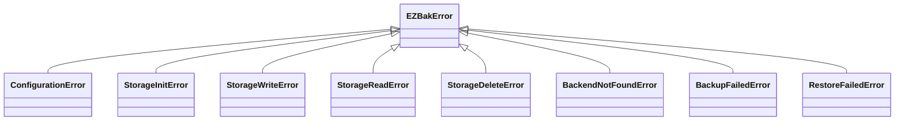

# Python API reference

The package exposes three names: `BackupConfig`, `EZBak`, and `ezbak`. Build a
`BackupConfig`, pass it to `EZBak`, and call the backup methods.

```python
from ezbak import EZBak, BackupConfig, ezbak
```

## BackupConfig

`BackupConfig` is the typed configuration model. It validates on construction and
raises `pydantic.ValidationError` when a required option is missing or a value is
malformed. Every field is listed in the [configuration reference](configuration.md).

```python
from pathlib import Path
from ezbak import BackupConfig

config = BackupConfig(
    name="my-backup",
    source_paths=[Path("/data")],
    storage_paths=[Path("/backups")],
    keep_last=10,
)
```

A `BackupConfig` needs a `name` and at least one storage location
(`storage_paths`, `aws_s3_bucket_name`, or both). It does not read the
environment; only the CLI and container do that.

## EZBak

`EZBak` is the one public class. Construct it with a `BackupConfig`.

```python
from ezbak import EZBak, BackupConfig

backups = EZBak(BackupConfig(name="my-backup", source_paths=["/data"], storage_paths=["/backups"]))
```

### ezbak() shortcut

`ezbak(**kwargs)` builds the `BackupConfig` for you. These two lines are
equivalent:

```python
backups = ezbak(name="my-backup", source_paths=["/data"], storage_paths=["/backups"])
backups = EZBak(BackupConfig(name="my-backup", source_paths=["/data"], storage_paths=["/backups"]))
```

Prefer `EZBak(BackupConfig(...))` when you want an explicit, reusable config
object. Reach for `ezbak(**kwargs)` in quick scripts.

### Methods

| Method | Returns | Purpose |
| --- | --- | --- |
| `create_backup()` | `list[Backup]` | Archive the sources and write to every storage location. |
| `list_backups()` | `list[Backup]` | Every backup, oldest to newest. |
| `prune_backups(dry_run=False)` | `list[Backup]` | Delete backups the keep rules no longer keep. |
| `restore_backup(restore_path=None, *, clean_before_restore=False, backup=None)` | `bool` | Restore a backup into a directory. |
| `get_latest_backup()` | `Backup \| None` | The newest backup, or `None` if there are none. |
| `get_backup_as_of(point_in_time)` | `Backup \| None` | The newest backup at or before a point in time. |

```python
backups.create_backup()
print([backup.name for backup in backups.list_backups()])
backups.prune_backups()
backups.restore_backup(restore_path="/restore")
```

`prune_backups(dry_run=True)` returns the backups the policy would delete without
removing any of them. A real prune returns the backups it confirmed deleted.

`restore_backup()` returns `False` only when there is no backup to restore. It
raises `RestoreFailedError` on a real download or extract failure, so a failed
restore never looks like a success.

### Point-in-time restore

`get_backup_as_of(point_in_time)` returns the newest backup at or before the end
of the period you name. Pass its result to `restore_backup(backup=...)`.

```python
backup = backups.get_backup_as_of("20241201")
if backup:
    backups.restore_backup(restore_path="/restore", backup=backup)
```

An explicit `backup` argument takes priority over a configured `restore_date`,
which in turn takes priority over the latest backup.

## Exceptions

Every ezbak error subclasses `EZBakError`, so one `except EZBakError` catches any
failure.



| Exception | Raised when |
| --- | --- |
| `ConfigurationError` | A path or other precondition is invalid: no sources, a source that does not exist, an unusable restore path. |
| `StorageInitError` | A storage location cannot be initialized: bad credentials, unreachable bucket. |
| `StorageWriteError` | A backend cannot write an archive. |
| `StorageReadError` | A backend cannot read an archive back for restore. |
| `StorageDeleteError` | A backend cannot delete an archive during a prune. |
| `BackendNotFoundError` | Internal invariant failure: no backend handles a storage type. |
| `BackupFailedError` | One or more storage locations could not be written. |
| `RestoreFailedError` | An archive could not be downloaded, read, or extracted. |

Import them from `ezbak.exceptions`:

```python
from ezbak.exceptions import EZBakError, BackupFailedError, RestoreFailedError
```

### BackupFailedError

`create_backup()` raises `BackupFailedError` when a configured storage location
cannot be used. It still writes to every location that works, so a partial
failure keeps the copies that succeeded.

```python
from ezbak.exceptions import BackupFailedError

try:
    backups.create_backup()
except BackupFailedError as error:
    print(f"Failed storage locations: {error.failed_storage_locations}")
    print(f"Backups that succeeded: {[b.name for b in error.created_backups]}")
```

The error carries two attributes:

- `failed_storage_locations`: the destinations that failed.
- `created_backups`: the `Backup` objects written before the failure.

### RestoreFailedError

`restore_backup()` raises `RestoreFailedError` when the archive cannot be
downloaded, read, or extracted. This matters most with `clean_before_restore`,
which empties the target before extracting: without the raised error, a silent
failure would leave an empty directory and no signal.

```python
from ezbak.exceptions import RestoreFailedError

try:
    backups.restore_backup(restore_path="/restore")
except RestoreFailedError as error:
    print(f"Restore failed: {error}")
```

See [Failure behavior](../concepts/failure-behavior.md) for how the library, CLI,
and container each surface these errors.
