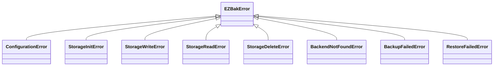

# Python API reference

The package exposes three names: `BackupConfig`, `EZBak`, and `ezbak`. Build a
`BackupConfig`, pass it to `EZBak`, and call the backup methods.

```python
from ezbak import EZBak, BackupConfig, ezbak
```

## BackupConfig

`BackupConfig` is the typed configuration model. It validates on construction. It
raises `pydantic.ValidationError` when a required option is missing, or when a
value is malformed. Every field is in the
[configuration reference](configuration.md).

```python
from pathlib import Path
from ezbak import BackupConfig

config = BackupConfig(
    name="my-backup",
    source_paths=[Path("/data")],
    storage_paths=[Path("/backups")],
    keep_last=10,
)
```

A `BackupConfig` needs a `name` and at least one storage location
(`storage_paths`, `aws_s3_bucket_name`, or both). It does not read the
environment. Only the CLI and the container do that.

## EZBak

`EZBak` is the one public class. Construct it with a `BackupConfig`.

```python
from ezbak import EZBak, BackupConfig

backups = EZBak(BackupConfig(name="my-backup", source_paths=["/data"], storage_paths=["/backups"]))
```

### ezbak() shortcut

`ezbak(**kwargs)` builds the `BackupConfig` for you. These two lines are
equivalent:

```python
backups = ezbak(name="my-backup", source_paths=["/data"], storage_paths=["/backups"])
backups = EZBak(BackupConfig(name="my-backup", source_paths=["/data"], storage_paths=["/backups"]))
```

When you want an explicit, reusable configuration object, prefer
`EZBak(BackupConfig(...))`. Use `ezbak(**kwargs)` in quick scripts.

### Methods

| Method | Returns | Purpose |
| --- | --- | --- |
| `create_backup()` | `list[Backup]` | Archive the sources and write to every storage location. |
| `list_backups()` | `list[Backup]` | Every backup, oldest to newest. |
| `prune_backups(dry_run=False)` | `list[Backup]` | Delete the backups the keep rules no longer keep. |
| `restore_backup(restore_path=None, *, clean_before_restore=False, backup=None)` | `RestoreOutcome` | Restore a backup into a directory. |
| `get_latest_backup()` | `Backup \| None` | The newest backup, or `None` when there are none. |
| `get_backup_as_of(point_in_time)` | `Backup \| None` | The newest backup at or before a point in time. |

```python
backups.create_backup()
print([backup.name for backup in backups.list_backups()])
backups.prune_backups()
backups.restore_backup(restore_path="/restore")
```

`prune_backups(dry_run=True)` returns the backups the policy no longer keeps, and
deletes none of them. A real prune returns the backups it confirmed deleted.

Two cases are not errors: no backup to restore, and a target ezbak declined to
overwrite. For those, `restore_backup()` returns a `RestoreOutcome` member and
raises nothing. It still raises `RestoreFailedError` on a real download or extract
failure, so a failed restore never looks like a success.

!!! warning "Breaking change: restore_backup() no longer returns a bool"

    `restore_backup()` returned `True` on a successful restore, and `False` when
    there was no backup to restore. It now returns a `RestoreOutcome` member.
    Update the code that reads the return value as a boolean:

    ```python
    # Before
    if not backups.restore_backup():
        print("Nothing to restore")

    # After
    from ezbak.constants import RestoreOutcome

    outcome = backups.restore_backup()
    if outcome is RestoreOutcome.NO_BACKUP:
        print("Nothing to restore")
    ```

### RestoreOutcome

`restore_backup()` returns one of three `RestoreOutcome` members, so a caller can
tell an actual restore apart from a no-op:

| Member | Meaning |
| --- | --- |
| `RestoreOutcome.RESTORED` | ezbak extracted a backup into the target. |
| `RestoreOutcome.NO_BACKUP` | No backup matched the restore criteria. |
| `RestoreOutcome.SKIPPED_POPULATED` | `skip_restore_if_populated` is set and the target already held data, so ezbak left it alone. |

Import `RestoreOutcome` from `ezbak.constants`:

```python
from ezbak.constants import RestoreOutcome

outcome = backups.restore_backup(restore_path="/restore")
match outcome:
    case RestoreOutcome.RESTORED:
        print("Restored")
    case RestoreOutcome.NO_BACKUP:
        print("Nothing to restore")
    case RestoreOutcome.SKIPPED_POPULATED:
        print("Target already had data; left it alone")
```

See [Restore backups](../guides/restore.md) for `skip_restore_if_populated`, and
[Fresh deploys](../orchestration/fresh-deploys.md) for the pre-start restore that
both outcomes support.

### Point-in-time restore

`get_backup_as_of(point_in_time)` returns the newest backup at or before the end
of the period you name. Pass its result to `restore_backup(backup=...)`.

```python
backup = backups.get_backup_as_of("20241201")
if backup:
    backups.restore_backup(restore_path="/restore", backup=backup)
```

An explicit `backup` argument takes priority over a configured `restore_date`,
which in turn takes priority over the latest backup.

### unreadable_locations

`list_backups()` never raises. It returns whatever backups it found, even when a
configured storage location cannot be read. Read the `unreadable_locations`
property alongside it to know whether that result is the whole picture.

```python
backups.list_backups()
if backups.unreadable_locations:
    print(f"Inventory incomplete: could not read {', '.join(backups.unreadable_locations)}")
```

A non-empty list names the storage locations ezbak cannot use or enumerate. The
cause is a bad S3 credential, an unreachable bucket, or a local path ezbak cannot
read. A backup absent from `list_backups()` can therefore still exist in one of those
locations. `create_backup()` and `restore_backup()` treat the same condition as a
hard failure instead of an incomplete result. See
[BackupFailedError](#backupfailederror) and
[RestoreFailedError](#restorefailederror) below.

The property indexes the storage locations when they are not indexed yet. The
first access therefore performs network I/O against S3, instead of returning a
cached attribute.

!!! note "An empty inventory is cached until the next backup run"

    ezbak caches an index that finds zero backups like any other index.
    `list_backups()` therefore keeps returning that result until
    `create_backup()` or `prune_backups()` invalidates it. A long-lived process
    that watches for archives another writer creates has to set
    `rebuild_storage_locations = True` to force a fresh scan.

!!! note "ezbak builds its own boto3 session"

    S3 access goes through a `boto3.Session` that ezbak constructs itself, so
    ezbak does not use a session installed with `boto3.setup_default_session()`.
    Pass credentials through `BackupConfig`, or leave them unset to use the
    ambient credential chain.

## Exceptions

Every exception the library raises subclasses `EZBakError`, so one
`except EZBakError` catches any failure.


```mermaid
classDiagram
  EZBakError <|-- ConfigurationError
  EZBakError <|-- StorageInitError
  EZBakError <|-- StorageWriteError
  EZBakError <|-- StorageReadError
  EZBakError <|-- StorageDeleteError
  EZBakError <|-- BackendNotFoundError
  EZBakError <|-- BackupFailedError
  EZBakError <|-- RestoreFailedError
```

| Exception | Raised when |
| --- | --- |
| `ConfigurationError` | A path or another precondition is invalid: no sources, a source that does not exist, an unusable restore path. |
| `StorageInitError` | A storage location cannot be initialized: bad credentials, an unreachable bucket. |
| `StorageWriteError` | A backend cannot write an archive. |
| `StorageReadError` | A backend cannot read an archive back for a restore. |
| `StorageDeleteError` | A backend cannot delete an archive during a prune. |
| `BackendNotFoundError` | Internal invariant failure: no backend handles a storage type. |
| `BackupFailedError` | One or more storage locations cannot be written. |
| `RestoreFailedError` | An archive cannot be downloaded, read, or extracted. |

Import them from `ezbak.exceptions`:

```python
from ezbak.exceptions import EZBakError, BackupFailedError, RestoreFailedError
```

### BackupFailedError

`create_backup()` raises `BackupFailedError` when a configured storage location
cannot be used. It still writes to every location that works, so a partial
failure keeps the copies that succeeded.

```python
from ezbak.exceptions import BackupFailedError

try:
    backups.create_backup()
except BackupFailedError as error:
    print(f"Failed storage locations: {error.failed_storage_locations}")
    print(f"Backups that succeeded: {[b.name for b in error.created_backups]}")
```

The error carries two attributes:

- `failed_storage_locations`: the locations that failed.
- `created_backups`: the `Backup` objects written before the failure.

### RestoreFailedError

`restore_backup()` raises `RestoreFailedError` when it cannot download, read, or
extract the archive. This matters most with `clean_before_restore`, which empties
the target before the extract. Without the raised error, a silent failure leaves
an empty directory and no signal.

```python
from ezbak.exceptions import RestoreFailedError

try:
    backups.restore_backup(restore_path="/restore")
except RestoreFailedError as error:
    print(f"Restore failed: {error}")
```

See [Failure behavior](../concepts/failure-behavior.md) for how the library, the
CLI, and the container each surface these errors.
